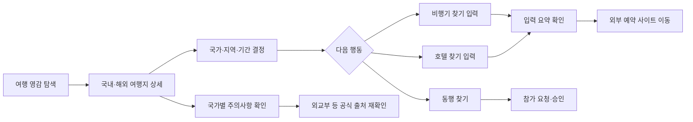
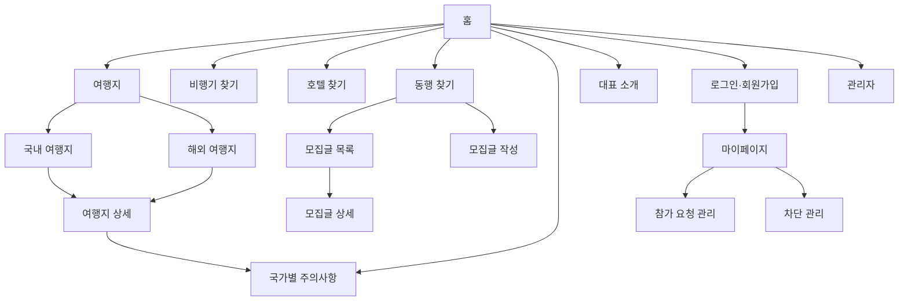

# Free Traveler 여행 탐색·외부 연결·동행·안전정보 플랫폼 PRD v1.0

- **Document ID:** PRD-TRAVEL-001
- **Owner:** Product & Engineering
- **작성일:** 2026-08-20
- **상태:** Approved for SRS
- **제품 대표:** `free_traveler`
- **대상 플랫폼:** 반응형 웹(Mobile First)

---

## 1. 개요·목표

### 1-1. 제품 한 줄 비전

> **어디로 갈지 정하고, 필요한 여행 조건을 정리하고, 믿을 수 있는 안전정보와 동행을 한곳에서 확인한 뒤 실제 예약 서비스로 자연스럽게 이동하는 여행 준비 허브.**

### 1-2. 문제 정의

자유여행자는 여행지 탐색, 항공권·숙박 사이트 이동, 동행 모집, 국가별 안전정보 확인을 서로 다른 서비스에서 반복한다. 이 과정에서 목적지와 날짜를 다시 정리해야 하고, 오래되거나 출처가 불분명한 정보와 공개 연락처 중심의 동행 모집으로 인해 불필요한 위험이 발생한다.

| Pain ID | 문제 | 사용자 영향 | MVP 해결 방향 |
|---|---|---|---|
| **PAIN-01** | 여행지 정보가 명소 사진이나 짧은 소개에 치우쳐 실제 일정 수립에 필요한 정보가 부족하다 | 여러 블로그와 지도를 반복 탐색 | 여행지별 일정·예산·교통·음식·주의사항을 정형화해 제공 |
| **PAIN-02** | 항공·호텔을 찾기 전에 목적지와 날짜를 정리하는 흐름이 분리되어 있다 | 여행 조건을 잊거나 잘못 입력 | 국가·지역·여행 기간을 먼저 입력하고 요약 확인 후 외부 사이트로 이동 |
| **PAIN-03** | 동행 모집에서 나이 확인, 신고·차단, 공개 연락처 보호가 부족하다 | 스팸·괴롭힘·사기·개인정보 노출 위험 | 만 19세 이상 회원, 참가 요청·승인, 신고·차단, 관리자 처리 도입 |
| **PAIN-04** | 국가별 치안·법규·재난·보건 정보가 흩어지고 갱신 시점을 알기 어렵다 | 오래된 정보를 최신 정보로 오인 | 공식 출처·최종 확인일·갱신 상태를 함께 표시 |
| **PAIN-05** | 여행 콘텐츠 작성자의 경험과 기준이 드러나지 않는다 | 추천을 신뢰할 근거가 부족 | `free_traveler`의 50회 이상·30개국 이상 여행 경험과 편집 원칙 공개 |

### 1-3. 제품 목표

| 목표 ID | 목표 | MVP 목표값 | 측정 시점 |
|---|---|---:|---|
| **GOAL-01** | 여행지 상세 열람 후 항공·호텔 외부 이동까지의 의사결정 흐름 단축 | 중간값 **10분 이내** | Public Beta 4주차 |
| **GOAL-02** | 여행 조건 입력을 완료한 사용자의 외부 이동 전환 | 입력 시작 대비 **60% 이상** | Public Beta 4주차 |
| **GOAL-03** | 소개되는 해외 국가의 안전정보 커버리지 확보 | **100%** | MVP 출시 전 |
| **GOAL-04** | 여행지 콘텐츠 필수 항목 충족 | 게시 여행지의 **100%** | MVP 출시 전 |
| **GOAL-05** | 안전한 동행 참가 요청 흐름 제공 | 유효 요청 제출 성공률 **99% 이상** | Closed Beta |
| **GOAL-06** | 신고 접수와 운영 대응의 예측 가능성 확보 | 접수 즉시 확인, 1차 검토 **24시간 이내 90% 이상** | Public Beta 4주차 |

### 1-4. 성공 지표

#### North Star KPI

| KPI | 정의 | 목표 | 측정 주기 |
|---|---|---:|---|
| **Trip Intent Completion Rate** | 여행지 상세를 본 세션 중 항공·호텔 외부 이동 또는 동행 참가 요청 중 하나를 완료한 세션 비율 | **30% 이상** | 주간 |

#### 보조 KPI

| 구분 | KPI | 산식 | 목표 |
|---|---|---|---:|
| 콘텐츠 | 여행지 상세 완독 대용 지표 | 상세 페이지 50% 이상 스크롤 세션 / 상세 조회 세션 | 55% 이상 |
| 항공 | 항공 외부 이동 완료율 | `flight_outbound_click` / `flight_form_start` | 60% 이상 |
| 호텔 | 호텔 외부 이동 완료율 | `hotel_outbound_click` / `hotel_form_start` | 60% 이상 |
| 안전 | 안전정보 확인률 | `safety_section_view` / 해외 여행지 상세 조회 | 40% 이상 |
| 동행 | 참가 요청 전환율 | 유효 참가 요청 / 동행글 상세 조회 | 15% 이상 |
| 운영 | 신고 1차 검토 SLA | 24시간 이내 1차 검토 신고 / 전체 신고 | 90% 이상 |
| 품질 | 콘텐츠 완전성 | 필수 필드 충족 게시물 / 전체 게시물 | 100% |
| 최신성 | 안전정보 최신성 | 7일 이내 확인된 안전 페이지 / 전체 게시 안전 페이지 | 95% 이상 |

> 신규 서비스이므로 행동 지표의 기준선은 Alpha와 Closed Beta에서 최초 측정한다. 목표값은 MVP 운영 목표이며 외부 시장 통계로 표현하지 않는다.

---

## 2. 사용자와 페르소나

### 2-1. 핵심 페르소나

| ID | 페르소나 | 상황 | 핵심 과업 | 주요 불안 |
|---|---|---|---|---|
| **P1** | 영감 탐색자 | 휴가 계획을 시작했지만 목적지가 정해지지 않음 | 테마·계절·예산으로 여행지 발견 | 정보가 얕거나 광고성일 가능성 |
| **P2** | 실행형 자유여행자 | 목적지 후보가 있고 항공·호텔 사이트로 이동하려 함 | 국가·지역·기간을 먼저 정리하고 외부 예약 사이트 열기 | 날짜·목적지를 잘못 기억하거나 입력 |
| **P3** | 동행 탐색자 | 혼자 떠나기 부담스럽거나 일정 일부를 함께할 사람을 원함 | 조건이 맞는 모집글 탐색·참가 요청 | 공개 연락처, 사기, 괴롭힘, 나이 불일치 |
| **P4** | 안전 우선 여행자 | 해외 출국 전 위험·법규·긴급연락처를 확인하려 함 | 공식 출처와 갱신일이 있는 안전정보 확인 | 오래된 정보, 과장 또는 누락 |
| **P5** | 경험 기반 큐레이션 선호자 | 누가 어떤 기준으로 추천하는지 중시함 | 대표의 여행 경험과 편집 철학 확인 | 익명·무근거 추천 |

### 2-2. 사용자 여정

### 2-3. 제품 원칙

1. **출처가 없는 안전정보를 사실처럼 게시하지 않는다.**
2. **외부 사이트 이동을 내부 검색·가격 비교·예약으로 표현하지 않는다.**
3. **항공·호텔 입력값은 MVP에서 외부 사이트로 전달하거나 서버에 저장하지 않는다.**
4. **동행 기능은 편의보다 개인정보 보호와 신고 가능성을 우선한다.**
5. **여행사진은 이용허락 범위를 확인하고 출처·작가·원문 URL을 관리한다.**
6. **대표 경험은 일관된 브랜드 프로필로 제공한다.**

---

## 3. 가치 제안과 정보구조

### 3-1. 핵심 가치 제안

| 가치 | 설명 |
|---|---|
| **Discover** | 국내·해외 유명 여행지를 테마·계절·예산·여행 기간으로 발견한다. |
| **Decide** | 국가·지역·날짜를 입력하고 이동 전 요약을 확인해 여행 조건을 명확히 한다. |
| **Connect** | 항공·호텔 외부 서비스 또는 조건이 맞는 동행자와 연결한다. |
| **Stay Safe** | 국가별 주의사항을 공식 출처와 최종 확인일로 검증한다. |
| **Trust the Curator** | 50회 이상, 30개국 이상을 여행한 `free_traveler`의 기준과 경험을 확인한다. |

### 3-2. 사이트맵

### 3-3. MVP 콘텐츠 시드

#### 국내 여행지 10곳

서울, 부산, 제주, 경주, 강릉, 전주, 여수, 속초, 통영, 인천.

#### 해외 15개국·30개 도시

| 국가 | 도시 |
|---|---|
| 일본 | 도쿄, 오사카, 교토 |
| 대만 | 타이베이 |
| 태국 | 방콕, 치앙마이, 푸껫 |
| 베트남 | 다낭, 하노이, 호찌민 |
| 싱가포르 | 싱가포르 |
| 인도네시아 | 발리 |
| 필리핀 | 세부, 보라카이 |
| 말레이시아 | 쿠알라룸푸르 |
| 프랑스 | 파리, 니스 |
| 이탈리아 | 로마, 피렌체, 베네치아 |
| 스페인 | 바르셀로나, 마드리드 |
| 영국 | 런던 |
| 미국 | 뉴욕, 로스앤젤레스, 샌프란시스코 |
| 호주 | 시드니, 멜버른 |
| 뉴질랜드 | 오클랜드, 퀸스타운 |

> 위 목록은 MVP 편집 시드이며 객관적인 인기 순위를 주장하지 않는다. 게시 전 여행경보와 콘텐츠 이용권한을 별도로 검수한다.

### 3-4. 여행지 상세 콘텐츠 기준

모든 게시 여행지는 다음 필드를 충족해야 한다.

| 필수 항목 | 최소 기준 |
|---|---|
| 한눈에 보는 소개 | 300자 이상, 추천 대상 포함 |
| 대표 이미지 | 1장 이상, 대체텍스트·출처·라이선스 기록 |
| 핵심 명소·체험 | 5개 이상 |
| 추천 시기 | 월 또는 계절 단위, 비추천 시기 포함 |
| 추천 일정 | 1일 및 3일 일정 필수 |
| 예상 예산 | 숙박 제외·포함 범위를 명시한 범주형 안내 |
| 현지 교통 | 도착·도시 내 이동·결제 유의사항 |
| 음식 | 대표 음식 3개 이상, 알레르기·식습관 주의 가능 시 표시 |
| 문화·에티켓 | 3개 이상 |
| 안전정보 연결 | 해외 여행지는 국가별 주의사항 페이지 필수 연결 |
| 출처·수정일 | 출처 URL 1개 이상, 최종 수정일 표시 |

---

## 4. 사용자 스토리와 수용 기준

### Story 1. 국내·해외 여행지 발견

> **As a** 여행지를 아직 정하지 못한 사용자, **I want** 국가·도시·테마·계절·기간으로 풍부한 여행지를 탐색하고 싶다, **So that** 실제 여행 후보를 빠르게 좁힐 수 있다.

| AC | Given | When | Then | 기준 |
|---|---|---|---|---|
| **AC-D01** | 여행지 목록에 진입 | 국내 또는 해외 탭 선택 | 해당 구분의 게시 여행지만 표시 | 잘못 분류된 결과 0건 |
| **AC-D02** | 필터 사용 가능 | 계절·테마·기간 필터 적용 | 모든 조건을 만족하는 결과 표시 | p95 1초 이내 |
| **AC-D03** | 여행지 상세 진입 | 페이지 로드 | 3-4의 필수 콘텐츠 항목 표시 | 완전성 100% |
| **AC-D04** | 결과가 없음 | 필터 적용 | 빈 화면 대신 조건 완화 안내와 초기화 버튼 표시 | 안내 300ms 이내 |
| **AC-D05** | 해외 여행지 상세 | 안전정보 선택 | 해당 국가 주의사항으로 이동 | 잘못된 국가 연결 0건 |

### Story 2. 여행 조건 입력 후 항공 외부 사이트 이동

> **As a** 항공권을 알아보려는 사용자, **I want** 여행할 국가·지역·출발일·귀국일을 먼저 입력하고 확인한 뒤 외부 항공 사이트로 이동하고 싶다, **So that** 이동 전에 여행 조건을 명확히 할 수 있다.

| AC | Given | When | Then | 기준 |
|---|---|---|---|---|
| **AC-F01** | 항공 입력 화면 | 필수값 미입력 | 외부 이동 버튼 비활성화 및 필드별 오류 표시 | 누락 식별 100% |
| **AC-F02** | 날짜 입력 | 과거 출발일 또는 귀국일이 출발일보다 빠름 | 제출 차단 및 원인 안내 | 잘못된 제출 0건 |
| **AC-F03** | 유효한 국가·지역·기간 입력 | 계속 선택 | 입력 요약과 “입력값은 외부 사이트로 전달되지 않음” 안내 표시 | 요약 불일치 0건 |
| **AC-F04** | 요약 확인 | `항공편 보러 가기` 선택 | 설정된 외부 항공 사이트 일반 페이지를 새 탭으로 열기 | 성공률 99% 이상 |
| **AC-F05** | 외부 링크 설정 오류 | 이동 시도 | 현재 이동 불가 안내와 다시 시도 제공 | 깨진 동일 탭 이동 0건 |
| **AC-F06** | 이동 완료 | 브라우저 세션 종료 | 입력값을 서버 DB에 보존하지 않음 | 서버 저장 0건 |

### Story 3. 여행 조건 입력 후 호텔 외부 사이트 이동

> **As a** 숙소를 알아보려는 사용자, **I want** 숙박 국가·지역·체크인·체크아웃을 먼저 입력하고 확인한 뒤 외부 호텔 사이트로 이동하고 싶다, **So that** 숙박 조건을 정리한 상태에서 예약 서비스를 이용할 수 있다.

| AC | Given | When | Then | 기준 |
|---|---|---|---|---|
| **AC-H01** | 호텔 입력 화면 | 필수값 미입력 | 외부 이동 버튼 비활성화 및 오류 표시 | 누락 식별 100% |
| **AC-H02** | 날짜 입력 | 과거 체크인 또는 체크아웃이 체크인과 같거나 빠름 | 제출 차단 및 원인 안내 | 잘못된 제출 0건 |
| **AC-H03** | 유효한 입력 | 계속 선택 | 국가·지역·숙박 기간 요약과 비전달 안내 표시 | 요약 불일치 0건 |
| **AC-H04** | 요약 확인 | `호텔 보러 가기` 선택 | 설정된 외부 호텔 사이트 일반 페이지를 새 탭으로 열기 | 성공률 99% 이상 |
| **AC-H05** | 외부 사이트 이동 | 링크 생성 | 입력값을 URL 쿼리·본문·쿠키로 전달하지 않음 | 전달 0건 |

### Story 4. 안전한 동행 찾기

> **As a** 만 19세 이상의 여행자, **I want** 일정과 여행 스타일이 맞는 동행글을 찾고 참가를 요청하고 싶다, **So that** 공개 연락처 없이 안전하게 첫 연결을 만들 수 있다.

| AC | Given | When | Then | 기준 |
|---|---|---|---|---|
| **AC-M01** | 비회원 또는 성인 확인 미완료 | 글 작성·참가 요청 시도 | 로그인·성인 확인 화면으로 이동 | 우회 성공 0건 |
| **AC-M02** | 성인 인증 회원 | 국가·지역·기간·여행 스타일 필터 | 조건과 겹치는 공개·모집중 글 표시 | p95 1초 이내 |
| **AC-M03** | 글 작성 | 필수 필드와 안전수칙 동의 후 제출 | 연락처를 공개하지 않고 모집중 상태로 게시 | 공개 연락처 0건 |
| **AC-M04** | 모집중 글 | 참가 메시지 제출 | 작성자에게 요청이 전달되고 PENDING 상태 저장 | 성공률 99% 이상 |
| **AC-M05** | 작성자 | 요청 승인·거절 | 상태 변경 및 요청자에게 알림 | 상태 불일치 0건 |
| **AC-M06** | 사용자 | 신고 또는 차단 | 접수번호 표시, 이후 상호 콘텐츠 노출 제한 | 접수 3초 이내 |
| **AC-M07** | 여행 종료일 경과 | 배치 작업 실행 | 모집글 자동 마감 | 24시간 이내 |
| **AC-M08** | 전화번호·메신저 ID 패턴 포함 | 글 제출 | 공개 연락처 탐지 안내 후 제출 차단 | 탐지율 95% 이상 |

### Story 5. 국가별 주의사항 확인

> **As a** 해외 여행을 준비하는 사용자, **I want** 치안·사기·법규·재난·보건·긴급연락처를 공식 출처와 함께 보고 싶다, **So that** 출국 전 최신 정보를 직접 재확인할 수 있다.

| AC | Given | When | Then | 기준 |
|---|---|---|---|---|
| **AC-S01** | 해외 국가 페이지 | 주의사항 로드 | 필수 안전 카테고리와 최종 확인일 표시 | 누락 0건 |
| **AC-S02** | 외교부 여행경보 출처 등록 | 공식 출처 선택 | 새 탭에서 외교부 해외안전여행 페이지 열기 | 링크 성공률 99% 이상 |
| **AC-S03** | 마지막 확인 후 7일 초과 | 페이지 로드 | “최신 정보 재확인 필요” 경고와 공식 링크 우선 표시 | 경고 누락 0건 |
| **AC-S04** | 지역별 경보가 국가 전체와 다름 | 정보 표시 | 국가·지역 범위를 구분해 표시 | 범위 혼동 0건 |
| **AC-S05** | 여행금지·출국권고 등 중대 단계 | 페이지 로드 | 일반 여행 팁보다 상단에 경고 표시 | 상단 노출 100% |

### Story 6. 대표 소개 확인

> **As a** 추천자의 경험을 확인하려는 사용자, **I want** `free_traveler`의 여행 이력과 철학을 보고 싶다, **So that** 콘텐츠의 관점과 전문성을 이해할 수 있다.

| AC | Given | When | Then | 기준 |
|---|---|---|---|---|
| **AC-A01** | 대표 소개 페이지 | 페이지 로드 | 대표명, 50회 이상 여행, 30개국 이상 방문 표시 | 핵심 정보 누락 0건 |
| **AC-A02** | 여행사진 표시 | 이미지 로드 | 대체텍스트·출처·라이선스 메타데이터 제공 | 메타데이터 100% |
| **AC-A03** | 방문 국가 지도 또는 목록 | 국가 선택 | 대표 여행 기록 또는 관련 여행지로 이동 | 깨진 연결 0건 |

---

## 5. 기능 요구사항과 우선순위

### 5-1. MoSCoW

| Priority | 기능 |
|---|---|
| **Must** | 국내·해외 여행지 목록/상세, 필터, 항공·호텔 사전 입력과 요약, 외부 일반 페이지 이동, 국가별 안전정보, 대표 소개, 만 19세 이상 동행 모집·참가 요청·승인·신고·차단, 관리자 콘텐츠·신고 관리 |
| **Should** | 여행지 즐겨찾기, 최근 본 여행지, 링크 공유, 동행 요청 알림 이메일, 안전정보 갱신 알림 |
| **Could** | 입력값의 외부 검색 파라미터 전달, 여행 일정 빌더, 다국어, 앱 알림, 사용자 본인 인증 고도화 |
| **Won't** | 내부 항공·호텔 실시간 검색 결과, 가격 비교, 예약·발권·결제·취소·환불, 실시간 채팅, 영상통화, 실시간 위치 공유, 미성년자 동행, 공개 연락처, 자유 리뷰·별점, 무출처 AI 여행정보 |

### 5-2. 핵심 기능 정의

| Feature | 구현 핵심 | 사용자 가치 |
|---|---|---|
| **F1 Destination Guide** | 10개 국내 여행지, 15개국 30개 해외 도시, 정형 콘텐츠와 필터 | 얕은 소개를 넘은 일정 수립 정보 |
| **F2 Flight Link-out** | 국가·지역·출발일·귀국일 입력, 요약, 비전달 고지, 외부 일반 페이지 이동 | 이동 전 조건 명확화 |
| **F3 Hotel Link-out** | 국가·지역·체크인·체크아웃 입력, 요약, 비전달 고지, 외부 일반 페이지 이동 | 숙박 조건 정리 |
| **F4 Travel Mate** | 성인 회원, 모집글, 조건 필터, 참가 요청, 승인·거절, 신고·차단 | 공개 연락처 없는 동행 연결 |
| **F5 Country Safety** | 공식 출처, 경보 범위, 치안·법규·재난·보건·긴급연락처, 갱신 상태 | 최신성 판단 가능 |
| **F6 About free_traveler** | 50회 이상·30개국 이상 여행, 철학, 지도, 타임라인, 라이선스 이미지 | 추천 기준과 경험 확인 |
| **F7 Admin & Governance** | 여행지·안전 콘텐츠 CRUD, 게시 검수, 신고 처리, 감사 로그 | 지속 가능한 운영 |

---

## 6. 대표 소개 콘텐츠 정의

### 6-1. 확정 프로필

| 항목 | 내용 |
|---|---|
| 대표명 | `free_traveler` |
| 핵심 경력 | 자유여행 50회 이상, 30개국 이상 방문 |
| 여행 권역 | 아시아, 유럽, 북미, 오세아니아 중심 |
| 전문 영역 | 첫 자유여행 설계, 도시 간 이동, 일정 밀도 조절, 예산과 안전의 균형 |
| 여행 철학 | “좋은 여행은 많이 보는 여행이 아니라, 내가 감당할 수 있는 속도로 현지를 이해하는 여행이다.” |
| 콘텐츠 원칙 | 직접 이해한 정보와 공식 출처를 구분하고, 변동 가능한 정보에는 확인일을 표시한다. |

### 6-2. 소개문

`free_traveler`는 50회 이상의 자유여행으로 30개국 이상을 경험한 여행 큐레이터다. 유명 명소만 나열하기보다 이동 동선, 머무는 시간, 여행자의 체력, 안전정보까지 함께 살피는 여행을 지향한다. 처음 해외여행을 준비하는 사람도 목적지와 일정을 스스로 결정할 수 있도록 여행지의 장점뿐 아니라 불편한 점과 주의할 점을 함께 소개한다.

### 6-3. 대표 페이지 구성

1. 대표 이미지와 한 문장 소개
2. `50+ Trips`, `30+ Countries` 수치 카드
3. 여행 철학과 콘텐츠 편집 원칙
4. 방문 권역 지도
5. 대표 여행 타임라인
6. 추천 여행지 6곳
7. 여행 준비 체크리스트
8. 문의·SNS 링크

### 6-4. 이미지 정책

- 국내 사진은 한국관광공사 TourAPI 등 이용조건이 명확한 자료를 우선한다.
- 해외 및 대표 이미지는 Unsplash·Pexels 등 라이선스가 명시된 출처를 사용할 수 있다.
- 각 이미지에 `source_url`, `author`, `license_type`, `downloaded_at`, `alt_text`를 기록한다.
- 식별 가능한 인물이 특정 서비스의 대표 또는 보증인으로 오인될 수 있는 사진은 사용하지 않는다.
- 이미지 자체를 로고·상표로 사용하지 않는다.

---

## 7. 비기능 요구사항

### 7-1. 성능·가용성

| 항목 | 목표 |
|---|---:|
| 홈·목록·상세 LCP | 모바일 p75 **2.5초 이하** |
| 여행지 필터 결과 | p95 **1초 이하** |
| 항공·호텔 입력 검증 | 사용자 입력 후 **100ms 이내** |
| 동행 목록·필터 | p95 **1초 이하** |
| 신고 접수 응답 | p95 **3초 이하** |
| 월간 가용성 | **99.5% 이상** |
| 내부 API 5xx | **0.5% 이하** |

### 7-2. 보안·개인정보·안전

- HTTPS와 TLS 1.2 이상을 적용한다.
- 항공·호텔 폼의 국가·지역·날짜는 브라우저 상태로만 유지하고 서버 DB에 저장하지 않는다.
- 외부 이동은 `noopener`, `noreferrer`를 적용한 새 탭 링크를 사용한다.
- 동행 프로필은 이메일, 닉네임, 성인 확인 상태, 선택형 연령대·성별·여행 스타일만 수집한다.
- 정확한 생년월일은 저장하지 않고 만 19세 이상 여부와 확인 시각만 저장한다.
- 전화번호, 메신저 ID, 이메일 등 공개 연락처가 모집글 본문에 포함되지 않도록 검증한다.
- 신고자와 피신고자의 상세 정보는 관리자만 접근한다.
- 차단 관계에 있는 사용자끼리는 글·요청·프로필을 상호 노출하지 않는다.
- 동행 서비스가 신원이나 안전을 보증하지 않는다는 안전고지를 가입·작성·요청 단계에 표시한다.

### 7-3. 접근성

- WCAG 2.2 Level AA를 목표로 한다.
- 모든 의미 있는 이미지에 대체텍스트를 제공한다.
- 키보드만으로 검색, 폼 입력, 모달 닫기, 신고 제출이 가능해야 한다.
- 색상만으로 여행경보·상태를 구분하지 않고 텍스트 라벨을 병기한다.
- 오류 메시지는 해당 필드와 프로그램적으로 연결한다.
- 모바일 터치 대상은 최소 24×24 CSS px을 충족한다.

### 7-4. 콘텐츠·SEO·저작권

- 여행지 상세에는 고유한 제목, 설명, canonical URL, Open Graph 정보를 제공한다.
- 안전정보와 변동 가능 정보에 출처와 최종 확인일을 표시한다.
- 게시 전 콘텐츠 완전성 검사를 통과하지 못하면 공개할 수 없다.
- 이미지·텍스트 출처와 이용허락 정보를 관리자 DB에 보존한다.
- 여행경보, 비자, 검역, 보건 내용은 공식 기관의 최신 정보를 직접 확인하도록 안내한다.

---

## 8. 데이터·외부 인터페이스 개요

### 8-1. 핵심 엔터티

| 엔터티 | 역할 |
|---|---|
| `DESTINATION` | 국내·해외 국가·도시·여행지 기본 정보 |
| `DESTINATION_CONTENT` | 소개, 일정, 예산, 교통, 음식, 에티켓 |
| `COUNTRY_SAFETY` | 국가·지역별 주의사항, 경보, 출처, 확인일 |
| `MEDIA_ASSET` | 이미지 URL, 작가, 라이선스, 대체텍스트 |
| `REPRESENTATIVE_PROFILE` | `free_traveler` 소개와 여행 이력 |
| `USER` | 동행 서비스 계정과 성인 확인 상태 |
| `MATE_POST` | 동행 모집 조건과 상태 |
| `MATE_APPLICATION` | 참가 요청과 승인·거절 상태 |
| `USER_BLOCK` | 사용자 차단 관계 |
| `REPORT` | 신고 대상·사유·처리 상태 |
| `AUDIT_LOG` | 관리자 변경·처리 이력 |

> 항공·호텔 입력값은 영속 엔터티로 만들지 않는다.

### 8-2. 외부 연결

| 시스템 | 용도 | MVP 연동 방식 | 데이터 전달 |
|---|---|---|---|
| Google Flights | 항공권 탐색 외부 이동 | 설정된 일반 랜딩 URL 새 탭 열기 | 없음 |
| Booking.com | 호텔 탐색 외부 이동 | 설정된 일반 랜딩 URL 새 탭 열기 | 없음 |
| 외교부 해외안전여행 | 여행경보·안전정보 원문 확인 | 국가 안전 페이지에서 공식 링크 제공 | 없음 |
| 한국관광공사 TourAPI | 국내 관광 콘텐츠·이미지 후보 | 관리자 수집 또는 향후 API 연동 | 운영 단계에서 결정 |
| Supabase | 회원·동행·콘텐츠 데이터 | PostgreSQL, Auth, Storage | 내부 시스템 |

외부 URL은 환경설정으로 교체 가능해야 하며 특정 업체의 예약 가능성, 가격, 재고를 보장하지 않는다.

---

## 9. 범위와 배제 범위

### 9-1. In Scope

- 국내 10개 이상, 해외 15개국 30개 도시 이상의 여행지 콘텐츠
- 소개되는 해외 15개국 전체의 국가별 주의사항
- 항공·호텔 국가·지역·기간 입력, 요약 확인, 외부 일반 페이지 이동
- 반응형 웹과 모바일 우선 UX
- 만 19세 이상 동행 모집·검색·참가 요청·승인·거절·신고·차단
- `free_traveler` 대표 소개 페이지
- 콘텐츠·이미지·안전정보·신고 관리자 기능
- 기본 행동 분석과 운영 로그

### 9-2. Out of Scope

- 실제 항공편·호텔 검색 API와 검색 결과
- 외부 사이트로의 입력값 자동 전달
- 가격 비교, 가격 알림, 예약 재고 확인
- 예약·발권·결제·취소·환불 고객지원
- 동행자 실시간 채팅, 영상통화, 위치 공유
- 미성년자 동행 서비스
- 정부 발급 신분증 기반 신원 보증
- 사용자 자유 리뷰·별점·무제한 커뮤니티
- 법률·의료·비자 승인에 대한 보증
- 출처 확인 없이 생성된 여행·안전 콘텐츠
- 네이티브 앱과 다국어 지원

---

## 10. 리스크·가정·의존성

### 10-1. 리스크

| ID | 리스크 | 확률 | 영향 | 대응 |
|---|---|---:|---:|---|
| **R-01** | 사용자가 외부 이동을 내부 항공·호텔 검색으로 오인 | 3 | 4 | 결과를 제공하지 않는다는 문구와 입력값 비전달 고지를 폼·요약에 반복 표시 |
| **R-02** | 외부 사이트 URL 또는 정책 변경 | 3 | 3 | 환경변수 관리, 주간 링크 점검, 장애 폴백 |
| **R-03** | 안전정보 갱신 지연 | 3 | 5 | 7일 초과 경고, 공식 원문 우선 링크, 긴급 변경 24시간 이내 반영 |
| **R-04** | 동행 사기·괴롭힘·공개 연락처 노출 | 4 | 5 | 성인 제한, 연락처 탐지, 참가 요청 방식, 신고·차단, 관리자 SLA |
| **R-05** | 여행사진 저작권·초상권 문제 | 3 | 4 | 이용허락 메타데이터 의무화, 인물 보증 오인 금지, 게시 전 검수 |
| **R-06** | 여행지 콘텐츠 대량 구축으로 품질 저하 | 3 | 3 | 필수 콘텐츠 스키마, 게시 게이트, 단계별 시드 확장 |
| **R-07** | 대표 프로필의 수치·경험 표현 불일치 | 2 | 3 | 전역에서 `50+`, `30+` 단일 데이터 소스 사용 |

### 10-2. 가정·의존성

| ID | 가정·의존성 | 검증 방법 |
|---|---|---|
| **A-01** | 외부 항공·호텔 일반 페이지를 새 탭으로 연결할 수 있다 | 출시 전 실제 브라우저 링크 점검 |
| **A-02** | 입력값을 전달하지 않아도 사전 조건 정리가 사용자에게 가치를 준다 | Closed Beta 과제 완료 시간·만족도 측정 |
| **A-03** | 초기 사용자는 한국어 사용자다 | Beta 유입·브라우저 언어 분석 |
| **A-04** | 안전정보는 외교부 해외안전여행을 최우선 공식 출처로 사용한다 | 운영 체크리스트 검수 |
| **D-01** | Supabase Auth·PostgreSQL·Storage 사용 가능 | 개발 착수 전 PoC |
| **D-02** | 이메일 알림 서비스 사용 가능 | 참가 요청 알림 PoC |
| **D-03** | 관리자가 안전정보를 최소 주 1회 검토할 수 있다 | 운영 담당자 지정 |

---

## 11. 출시·검증 계획

### 11-1. 단계

| 단계 | 범위 | 대상 | 종료 조건 |
|---|---|---|---|
| **Content Alpha** | 국내 3곳, 해외 3개국 6개 도시, 대표 소개 | 내부 5명 | 콘텐츠 완전성 100%, 깨진 링크 0건 |
| **Functional Alpha** | 항공·호텔 이동, 안전정보, 동행 기본 흐름 | 내부 10명 | Critical 결함 0건 |
| **Closed Beta** | 국내 10곳, 해외 15개국 30개 도시, 동행 신고 운영 | 초청 30명 | 주요 AC 통과율 95% 이상 |
| **Public Beta** | 전체 MVP | 공개 사용자 | 4주 운영 지표 수집, 신고 SLA 90% 이상 |
| **MVP Release** | 안정화·SEO·운영 매뉴얼 | 공개 | 출시 체크리스트 완료 |

### 11-2. 검증 가설

| ID | 가설 | 방법 | 성공 기준 |
|---|---|---|---|
| **H-01** | 정형 여행지 콘텐츠는 사용자의 목적지 결정을 돕는다 | 여행지 후보 선택 과제, n≥20 | 10분 이내 후보 선택 70% 이상 |
| **H-02** | 사전 입력·요약이 외부 이동 전 조건 명확화에 도움이 된다 | 기존 바로가기 vs 사전 입력 비교 | 입력 오류 자기보고 30% 감소 |
| **H-03** | 공식 출처와 확인일은 안전정보 신뢰를 높인다 | 전후 설문, 5점 척도 | 평균 4.0 이상 |
| **H-04** | 참가 요청·승인 방식이 공개 연락처 방식보다 안전하다고 느껴진다 | 동행 Beta 설문 | 안전 체감 평균 4.0 이상 |
| **H-05** | 대표 경험 공개가 콘텐츠 신뢰에 기여한다 | 대표 페이지 노출 전후 비교 | 신뢰도 +0.5점 이상 |

---

## 12. 참고자료와 콘텐츠 거버넌스

| ID | 출처 | 활용 |
|---|---|---|
| **REF-01** | 외교부 해외안전여행 — https://www.0404.go.kr/ | 국가·지역별 여행경보, 안전공지, 위기대응 원문 |
| **REF-02** | 한국관광공사 국문 관광정보 서비스 — https://www.data.go.kr/data/15101578/openapi.do | 국내 관광정보·이미지 후보와 이용조건 확인 |
| **REF-03** | 개인정보 보호법 제16조 — https://www.law.go.kr/법령/개인정보보호법 | 목적에 필요한 최소 개인정보 수집 원칙 |
| **REF-04** | WCAG 2.2 — https://www.w3.org/TR/WCAG22/ | 웹 접근성 Level AA 목표 |
| **REF-05** | Unsplash License — https://unsplash.com/license | 해외·대표 이미지 후보 이용조건 |
| **REF-06** | Pexels License — https://www.pexels.com/license/ | 해외·대표 이미지 후보 이용조건 |
| **REF-07** | Google Flights — https://www.google.com/travel/flights | 항공 외부 일반 랜딩 후보 |
| **REF-08** | Booking.com — https://www.booking.com/ | 호텔 외부 일반 랜딩 후보 |

### 12-1. 게시 전 체크리스트

- 여행지 필수 콘텐츠 항목 충족
- 국가·지역 명칭과 안전정보 연결 일치
- 공식 출처 URL과 최종 확인일 존재
- 여행경보의 단계·지역 범위 왜곡 없음
- 대표 수치가 `50+ Trips`, `30+ Countries`로 일관됨
- 이미지 출처·작가·라이선스·대체텍스트 존재
- 항공·호텔 폼에 입력값 비전달 고지 존재
- 동행 글에 공개 연락처와 금지 콘텐츠 없음
- 모바일·키보드·스크린리더 기본 동작 확인

---

> **다음 단계:** 본 PRD의 Feature·Story·Acceptance Criteria를 식별 가능한 소프트웨어 요구사항과 테스트 케이스로 변환한 `05_SRS_Travel_v1.md`를 구현 기준 문서로 사용한다.
