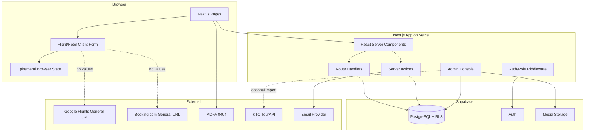
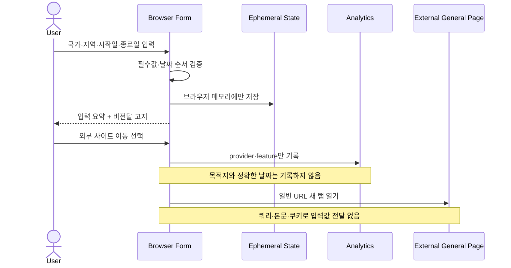
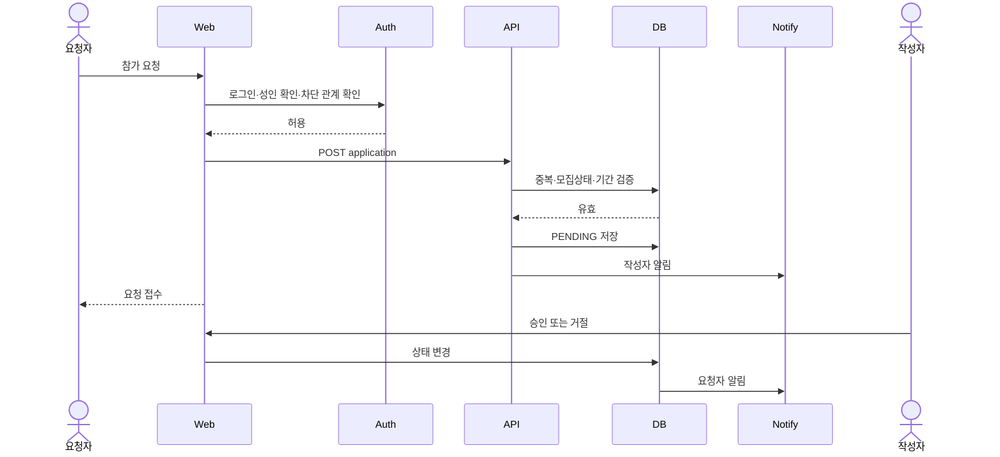
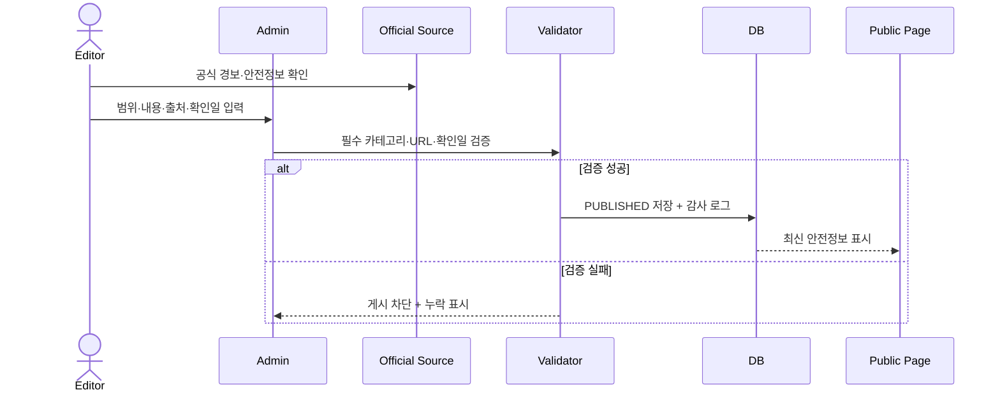
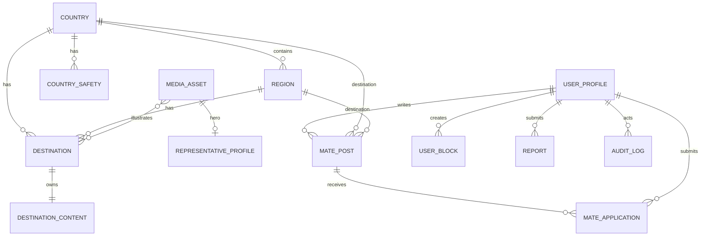
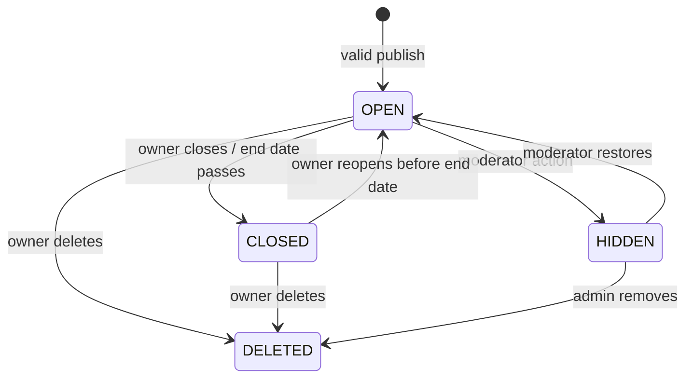
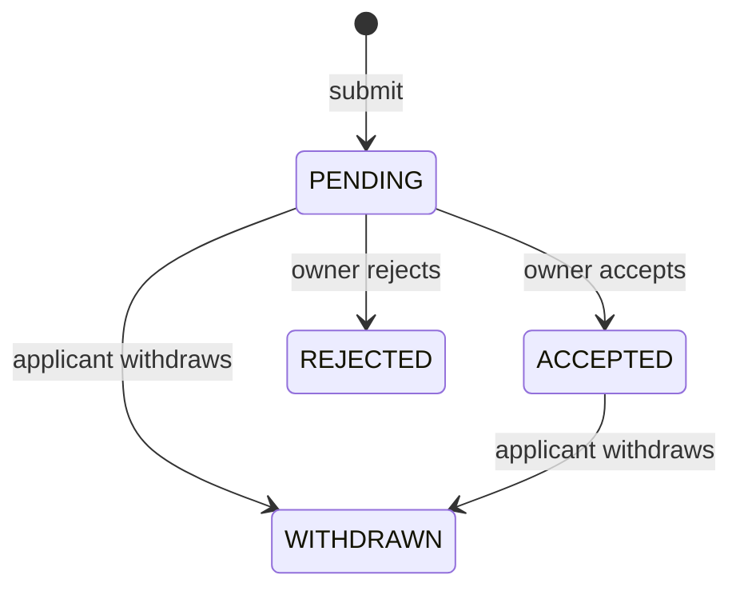
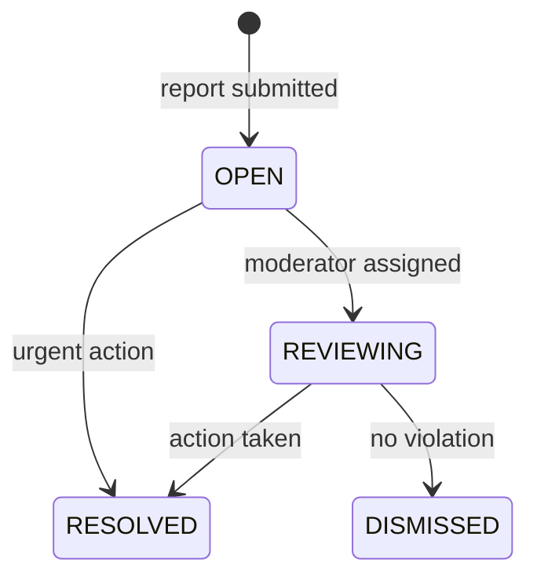

# Software Requirements Specification (SRS) — Free Traveler

**Document ID:** SRS-TRAVEL-001  
**Revision:** 1.0  
**Date:** 2026-08-20  
**Standard:** ISO/IEC/IEEE 29148:2018  
**Status:** Implementation Baseline

| 항목 | 내용 |
|---|---|
| 프로젝트명 | Free Traveler 여행 탐색·외부 연결·동행·안전정보 플랫폼 |
| 기반 문서 | `00_PRD_Travel_v1.md` |
| 제품 대표 | `free_traveler` |
| 기본 언어 | 한국어 (`ko-KR`) |
| 기본 플랫폼 | 반응형 웹, Mobile First |
| Owner | Product & Engineering |

---

## 1. Introduction

### 1.1 Purpose

본 문서는 Free Traveler 웹사이트의 구현·테스트·운영 요구사항을 정의한다. 시스템은 다음 여섯 가지 사용자 가치를 제공한다.

1. 국내·해외 유명 여행지의 정형화된 심층 정보
2. 국가·지역·여행 기간 입력과 요약 확인 후 외부 항공 사이트 이동
3. 국가·지역·숙박 기간 입력과 요약 확인 후 외부 호텔 사이트 이동
4. 만 19세 이상 회원을 위한 동행 모집·참가 요청·신고·차단
5. 공식 출처와 최종 확인일을 포함한 국가별 여행 주의사항
6. 여행 50회 이상·30개국 이상을 경험한 `free_traveler` 대표 소개

본 SRS의 독자는 개발자, QA, 콘텐츠 편집자, 운영자, 개인정보·안전 검토 담당자다. 각 요구사항은 고유 ID, 우선순위, 원천, 검증 가능한 수용 기준을 갖는다.

### 1.2 Scope

#### 1.2.1 In-Scope (MVP)

| ID | 범위 |
|---|---|
| **IS-01** | 국내 10개 이상의 여행지 목록·필터·상세 |
| **IS-02** | 해외 15개국 30개 도시 이상의 여행지 목록·필터·상세 |
| **IS-03** | 소개되는 모든 해외 국가의 안전정보 페이지 |
| **IS-04** | 항공 국가·지역·출발일·귀국일 입력, 요약, 일반 외부 페이지 이동 |
| **IS-05** | 호텔 국가·지역·체크인·체크아웃 입력, 요약, 일반 외부 페이지 이동 |
| **IS-06** | 이메일 회원가입, 만 19세 이상 확인, 동행 프로필 |
| **IS-07** | 동행 모집글·필터·참가 요청·승인·거절·마감 |
| **IS-08** | 공개 연락처 탐지, 신고·차단, 관리자 처리 |
| **IS-09** | `free_traveler` 대표 소개, 방문 국가, 여행 타임라인, 이미지 출처 |
| **IS-10** | 여행지·안전정보·미디어·신고·외부 URL 관리자 기능 |
| **IS-11** | 검색·SEO·접근성·행동 분석·감사 로그 |

#### 1.2.2 Out-of-Scope

| ID | 배제 범위 | 이유 |
|---|---|---|
| **OS-01** | 내부 항공편·호텔 실시간 검색 결과 | MVP는 외부 연결형 서비스 |
| **OS-02** | 입력값을 외부 사이트에 자동 전달 | 사용자 요구에 따라 MVP 배제 |
| **OS-03** | 가격 비교·재고 확인·예약·결제·발권·취소·환불 | 외부 예약사의 책임 범위 |
| **OS-04** | 동행 실시간 채팅·영상통화·실시간 위치 공유 | 안전·운영 복잡도 |
| **OS-05** | 미성년자 동행 모집·참가 | MVP 안전정책 |
| **OS-06** | 신분증 기반 신원보증 | MVP 비용·개인정보 위험 |
| **OS-07** | 공개 전화번호·메신저 ID·이메일 교환 | 개인정보 보호 |
| **OS-08** | 사용자 자유 리뷰·별점·범용 커뮤니티 | 핵심 기능 집중 |
| **OS-09** | 법률·의료·비자 승인 보증 | 공식 기관 원문 확인 필요 |
| **OS-10** | 출처 없는 자동 생성 여행·안전정보 | 정보 신뢰성 원칙 |
| **OS-11** | 네이티브 앱·다국어 | 후속 단계 |

#### 1.2.3 Constraints

| ID | 제약사항 | 유형 |
|---|---|---|
| **CON-01** | 항공·호텔 입력값은 브라우저 메모리 상태로만 처리하고 서버 DB·로그·외부 URL에 저장하지 않는다. | 개인정보/기술 |
| **CON-02** | 외부 이동 URL에는 목적지·날짜 쿼리 파라미터를 붙이지 않는다. | 제품 범위 |
| **CON-03** | 외부 링크는 새 탭과 `noopener,noreferrer`를 사용한다. | 보안 |
| **CON-04** | 동행 기능은 만 19세 이상 확인 회원만 이용한다. | 안전정책 |
| **CON-05** | 모집글 본문에 전화번호·이메일·메신저 ID 등 공개 연락처를 허용하지 않는다. | 개인정보/안전 |
| **CON-06** | 해외 안전정보는 공식 출처 URL과 최종 확인일 없이는 게시할 수 없다. | 콘텐츠 품질 |
| **CON-07** | 여행경보 단계와 적용 지역은 외교부 원문의 의미를 변경하지 않는다. | 안전 |
| **CON-08** | 모든 이미지에는 출처·작가·라이선스·대체텍스트를 기록한다. | 저작권/접근성 |
| **CON-09** | 대표 지표는 전역에서 `50+ Trips`, `30+ Countries`로 표현한다. | 콘텐츠 일관성 |
| **CON-10** | Next.js App Router 기반 단일 풀스택 애플리케이션으로 구현한다. | 아키텍처 |
| **CON-11** | TypeScript, Tailwind CSS, shadcn/ui를 사용한다. | 프론트엔드 |
| **CON-12** | Supabase PostgreSQL·Auth·Storage와 Row Level Security를 사용한다. | 데이터/인증 |
| **CON-13** | Vercel에 배포하고 환경변수로 외부 URL과 비밀정보를 관리한다. | 인프라 |
| **CON-14** | WCAG 2.2 Level AA를 목표로 한다. | 접근성 |

#### 1.2.4 Assumptions

| ID | 가정 | 검증 |
|---|---|---|
| **ASM-01** | 외부 항공·호텔 일반 랜딩 페이지가 한국에서 접근 가능하다. | 출시 전 브라우저 점검 |
| **ASM-02** | 외부 사이트 이동 전 입력·요약 흐름이 사용자에게 조건 정리 가치를 제공한다. | Closed Beta 과제·설문 |
| **ASM-03** | 사용자는 JavaScript가 활성화된 최신 브라우저를 사용한다. | 지원 브라우저 테스트 |
| **ASM-04** | 운영자가 안전정보를 최소 주 1회 확인한다. | 운영 일정·감사 로그 |
| **ASM-05** | 이메일 인증과 알림 발송을 위한 제공자를 사용할 수 있다. | 개발 PoC |
| **ASM-06** | 국내 관광정보·이미지는 이용조건을 확인한 TourAPI 또는 동등 출처로 확보한다. | 미디어 검수 |

#### 1.2.5 Contingency Plans

| ID | 상황 | 대응 |
|---|---|---|
| **CP-01** | 항공·호텔 외부 URL 장애 | 이동을 중단하고 “현재 외부 사이트에 연결할 수 없습니다” 표시, 관리자 경고 생성 |
| **CP-02** | 외교부 안전정보 확인 실패 | 저장된 정보에 “최신 정보 재확인 필요”를 표시하고 공식 메인 페이지 링크만 제공 |
| **CP-03** | 미디어 라이선스 증빙 누락 | 해당 이미지를 비공개 전환하고 기본 플레이스홀더 사용 |
| **CP-04** | 이메일 알림 장애 | 인앱 알림 상태를 유지하고 재시도 큐에 적재, 핵심 상태 변경은 DB에서 확인 가능하게 함 |
| **CP-05** | 동행 신고 급증 | 신규 글 작성 속도 제한, 관리자 긴급 모드, 고위험 계정 일시 제한 |
| **CP-06** | Supabase 장애 | 읽기 가능한 정적 여행지 페이지는 유지하고 동행 쓰기 기능을 일시 비활성화 |

### 1.3 Definitions

| 용어 | 정의 |
|---|---|
| **외부 연결(Link-out)** | 내부 결과를 제공하지 않고 제3자 웹사이트의 일반 페이지를 새 탭으로 여는 기능 |
| **여행 조건** | 국가, 지역·도시, 시작일, 종료일의 조합 |
| **입력값 비전달** | 여행 조건을 외부 URL, 요청 본문, 쿠키, 서버 로그로 전송하지 않는 것 |
| **여행지** | 국가 또는 도시 안에서 소개되는 관광 목적지 단위 |
| **국가 안전정보** | 치안·사기·법규·교통·재난·보건·문화·긴급연락처와 공식 출처의 집합 |
| **최종 확인일** | 편집자 또는 관리자가 공식 출처와 대조한 시각 |
| **Stale** | 안전정보 최종 확인 후 7일이 지난 상태 |
| **동행 모집글** | 여행 국가·지역·기간·스타일과 모집 조건을 포함한 회원 게시물 |
| **참가 요청** | 모집글 작성자에게 보내는 비공개 참여 의사 |
| **성인 확인** | 정확한 생년월일을 저장하지 않고 만 19세 이상 여부와 확인 시각을 기록하는 절차 |
| **공개 연락처** | 전화번호, 이메일, 카카오톡·텔레그램 등 메신저 ID 또는 외부 연락을 직접 가능하게 하는 식별자 |
| **차단** | 두 사용자 사이의 프로필·글·요청 노출과 상호작용을 제한하는 상태 |
| **콘텐츠 완전성** | 여행지 또는 안전 페이지가 정의된 필수 필드를 모두 충족한 상태 |
| **RLS** | Supabase PostgreSQL의 Row Level Security |
| **LCP/INP/CLS** | Core Web Vitals의 로딩·상호작용·시각 안정성 지표 |

### 1.4 References

| ID | 문서·서비스 | URL |
|---|---|---|
| **REF-01** | Free Traveler PRD v1.0 | `./00_PRD_Travel_v1.md` |
| **REF-02** | ISO/IEC/IEEE 29148:2018 | https://www.iso.org/standard/72089.html |
| **REF-03** | 외교부 해외안전여행 | https://www.0404.go.kr/ |
| **REF-04** | 한국관광공사 국문 관광정보 서비스 | https://www.data.go.kr/data/15101578/openapi.do |
| **REF-05** | 개인정보 보호법 | https://www.law.go.kr/법령/개인정보보호법 |
| **REF-06** | WCAG 2.2 | https://www.w3.org/TR/WCAG22/ |
| **REF-07** | Unsplash License | https://unsplash.com/license |
| **REF-08** | Pexels License | https://www.pexels.com/license/ |
| **REF-09** | Next.js App Router | https://nextjs.org/docs/app |
| **REF-10** | Supabase Documentation | https://supabase.com/docs |

---

## 2. Stakeholders and Permissions

### 2.1 Stakeholders

| 역할 | 책임 | 관심사 |
|---|---|---|
| 여행지 탐색 사용자 | 여행지·대표·안전정보 열람 | 풍부한 콘텐츠, 빠른 탐색 |
| 항공·호텔 이동 사용자 | 여행 조건 입력·요약·외부 이동 | 입력 정확성, 명확한 고지 |
| 동행 회원 | 모집글·참가 요청·신고·차단 | 개인정보와 안전 |
| 콘텐츠 편집자 | 여행지·대표·안전정보 관리 | 완전성, 출처, 최신성 |
| 운영 관리자 | 사용자·신고·외부 링크 관리 | 권한, 감사 가능성, SLA |
| Product Owner | 범위·우선순위·KPI 관리 | 목표 달성, 요구사항 추적 |
| 개발팀 | 구현·배포·운영 | 명확한 인터페이스·제약 |
| QA팀 | 기능·비기능 검증 | 재현 가능한 AC·테스트 데이터 |
| 개인정보·안전 검토자 | 수집 항목·동행 정책 검토 | 최소 수집, 오남용 방지 |

### 2.2 Role Permission Matrix

| 기능 | Guest | Adult Member | Editor | Moderator | Admin |
|---|:---:|:---:|:---:|:---:|:---:|
| 여행지·안전·대표 열람 | O | O | O | O | O |
| 항공·호텔 외부 이동 | O | O | O | O | O |
| 동행글 목록·상세 열람 | O | O | O | O | O |
| 동행글 작성·참가 요청 | X | O | X | O | O |
| 본인 글·요청 관리 | X | O | X | O | O |
| 신고·차단 | X | O | X | O | O |
| 여행지·안전 콘텐츠 CRUD | X | X | O | X | O |
| 신고 큐·제재 | X | X | X | O | O |
| 외부 URL·권한 관리 | X | X | X | X | O |
| 감사 로그 열람 | X | X | 제한 | 제한 | O |

---

## 3. System Context and Interfaces

### 3.1 Architecture

### 3.2 Technology Stack

| Layer | Technology | Responsibility |
|---|---|---|
| Web | Next.js App Router + TypeScript | SSR/SSG, routing, forms, server logic |
| UI | Tailwind CSS + shadcn/ui | 반응형 컴포넌트와 접근성 기반 UI |
| Data | Supabase PostgreSQL | 콘텐츠·동행·신고·감사 로그 |
| Auth | Supabase Auth | 이메일 인증·세션 |
| Storage | Supabase Storage | 라이선스 확인 미디어 |
| Deploy | Vercel | 빌드·배포·로그·웹 지표 |
| Test | Vitest, Testing Library, Playwright, axe-core | 단위·통합·E2E·접근성 |

### 3.3 External Systems

| ID | 시스템 | 역할 | 입력 전달 | 장애 처리 |
|---|---|---|---|---|
| **EXT-01** | Google Flights | 항공권 탐색 일반 페이지 | 없음 | 인라인 오류, 재시도 |
| **EXT-02** | Booking.com | 호텔 탐색 일반 페이지 | 없음 | 인라인 오류, 재시도 |
| **EXT-03** | 외교부 해외안전여행 | 공식 경보·안전정보 원문 | 없음 | stale 경고와 메인 링크 |
| **EXT-04** | 한국관광공사 TourAPI | 국내 콘텐츠·이미지 후보 | 관리자 키워드·API Key | 수동 입력 폴백 |
| **EXT-05** | 이메일 제공자 | 참가 요청·상태 알림 | 이메일, 템플릿 데이터 | 재시도 큐·인앱 상태 |

### 3.4 Client Applications

| ID | 클라이언트 | 지원 기준 |
|---|---|---|
| **CLT-01** | 모바일 웹 | 최근 2개 주요 버전의 iOS Safari·Android Chrome |
| **CLT-02** | 데스크톱 웹 | 최근 2개 주요 버전의 Chrome·Edge·Safari·Firefox |
| **CLT-03** | 인앱 브라우저 | 링크 열람을 지원하되 결함 발생 시 시스템 브라우저 열기 안내 |

### 3.5 Page and Route Inventory

| Route | Page | Access |
|---|---|---|
| `/` | 홈 | Public |
| `/destinations` | 전체 여행지 | Public |
| `/destinations/domestic` | 국내 여행지 | Public |
| `/destinations/overseas` | 해외 여행지 | Public |
| `/destinations/[slug]` | 여행지 상세 | Public |
| `/flights` | 비행기 찾기 입력·요약 | Public |
| `/hotels` | 호텔 찾기 입력·요약 | Public |
| `/mates` | 동행 모집글 목록 | Public |
| `/mates/[id]` | 동행 모집글 상세 | Public |
| `/mates/new` | 동행 모집글 작성 | Adult Member |
| `/safety` | 국가별 주의사항 목록 | Public |
| `/safety/[countryCode]` | 국가별 주의사항 상세 | Public |
| `/about` | 대표 소개 | Public |
| `/auth/*` | 가입·로그인·성인 확인 | Public/Member |
| `/my/*` | 내 글·참가 요청·차단 | Adult Member |
| `/admin/*` | 콘텐츠·신고·설정 | Role Restricted |

### 3.6 Use Cases

| ID | Use Case | Actor | Related Requirements |
|---|---|---|---|
| **UC-01** | 여행지 검색·필터·상세 열람 | Guest/Member | REQ-FUNC-001~010 |
| **UC-02** | 항공 여행 조건 입력·요약·외부 이동 | Guest/Member | REQ-FUNC-011~018 |
| **UC-03** | 호텔 숙박 조건 입력·요약·외부 이동 | Guest/Member | REQ-FUNC-019~026 |
| **UC-04** | 동행 모집글 작성·마감 | Adult Member | REQ-FUNC-027~033, 037~038 |
| **UC-05** | 동행 참가 요청·승인·거절 | Adult Member | REQ-FUNC-034~036, 043 |
| **UC-06** | 신고·차단·운영 처리 | Adult Member/Moderator | REQ-FUNC-039~045 |
| **UC-07** | 국가별 안전정보 확인 | Guest/Member | REQ-FUNC-046~056 |
| **UC-08** | 대표 소개 확인 | Guest/Member | REQ-FUNC-057~063 |
| **UC-09** | 콘텐츠·외부 URL 관리 | Editor/Admin | REQ-FUNC-072~077 |

### 3.7 Core Interaction Sequences

#### 3.7.1 항공·호텔 외부 이동

#### 3.7.2 동행 참가 요청

#### 3.7.3 안전정보 게시

---

## 4. Specific Requirements

> **Priority:** M=Must, S=Should, C=Could. “시스템은”으로 시작하는 문장은 구현·검증 대상이다.

### 4.1 Functional Requirements

#### 4.1.1 F1. Destination Guide

| ID | Requirement | P | Source | Acceptance Criteria |
|---|---|:---:|---|---|
| **REQ-FUNC-001** | 시스템은 국내·해외 여행지 목록을 구분해 제공한다. | M | Story 1 | 탭 변경 시 해당 구분의 게시 여행지만 표시되고 오분류가 없다. |
| **REQ-FUNC-002** | 시스템은 국가·도시·계절·테마·권장 기간 필터를 제공한다. | M | AC-D02 | 복수 필터는 AND 조건으로 적용되고 p95 1초 이내 결과가 표시된다. |
| **REQ-FUNC-003** | 시스템은 키워드로 여행지명·국가명·테마를 검색한다. | M | Story 1 | 한글 부분 일치 검색과 결과 없음 상태가 동작한다. |
| **REQ-FUNC-004** | 시스템은 여행지 상세에 소개·명소 5개 이상·추천 시기·1일/3일 일정·예산·교통·음식 3개 이상·에티켓·출처·수정일을 표시한다. | M | PRD 3-4 | 필수 필드가 하나라도 없으면 게시 상태로 변경할 수 없다. |
| **REQ-FUNC-005** | 시스템은 필터 결과가 없으면 조건 완화 안내와 전체 초기화 버튼을 제공한다. | M | AC-D04 | 빈 결과 300ms 이내 안내가 표시되고 초기화 후 전체 목록이 복원된다. |
| **REQ-FUNC-006** | 시스템은 해외 여행지 상세에서 해당 국가의 안전 페이지를 연결한다. | M | AC-D05 | destination.country_code와 safety.country_code가 일치한다. |
| **REQ-FUNC-007** | 시스템은 대표 이미지에 대체텍스트·출처·작가·라이선스를 연결한다. | M | PRD 6-4 | 공개 이미지의 메타데이터 충족률이 100%다. |
| **REQ-FUNC-008** | 시스템은 MVP 게시 기준 국내 10개 이상, 해외 15개국 30개 도시 이상을 검증한다. | M | PRD 3-3 | 출시 게이트에서 수량 미달 시 실패한다. |
| **REQ-FUNC-009** | 시스템은 같은 국가·테마의 관련 여행지를 상세 하단에 최대 6개 표시한다. | S | Discover | 비공개·현재 여행지는 추천에서 제외된다. |
| **REQ-FUNC-010** | 시스템은 목록 필터 상태를 URL query에 반영해 새로고침·공유 시 복원한다. | S | Discover | 허용 필터만 직렬화되고 잘못된 값은 무시된다. |

#### 4.1.2 F2. Flight Link-out

| ID | Requirement | P | Source | Acceptance Criteria |
|---|---|:---:|---|---|
| **REQ-FUNC-011** | 시스템은 항공 폼에 목적 국가, 지역·도시, 출발일, 귀국일을 필수 입력으로 제공한다. | M | Story 2 | 네 필드가 라벨·도움말·오류 영역과 함께 표시된다. |
| **REQ-FUNC-012** | 시스템은 선택 국가에 속하는 지역·도시만 선택 가능하게 한다. | M | AC-F01 | 국가 변경 시 유효하지 않은 기존 지역값을 초기화한다. |
| **REQ-FUNC-013** | 시스템은 출발일이 오늘 이전이거나 귀국일이 출발일보다 빠르면 진행을 차단한다. | M | AC-F02 | 경계값 테스트에서 잘못된 날짜 제출이 0건이다. |
| **REQ-FUNC-014** | 시스템은 유효한 입력 후 국가·지역·출발일·귀국일 요약 단계를 표시한다. | M | AC-F03 | 수정 버튼으로 폼에 돌아가도 값이 브라우저 세션 동안 유지된다. |
| **REQ-FUNC-015** | 시스템은 폼과 요약에 “입력값은 외부 사이트로 전달되지 않습니다”를 표시한다. | M | CON-02 | 외부 이동 전 고지가 시각적·프로그램적으로 노출된다. |
| **REQ-FUNC-016** | 시스템은 외부 이동 시 설정된 항공 일반 URL을 새 탭으로 열고 `noopener,noreferrer`를 적용한다. | M | AC-F04 | 목적지·날짜 query가 없고 opener 접근이 불가하다. |
| **REQ-FUNC-017** | 시스템은 항공 입력값을 서버 DB, 서버 로그, 분석 이벤트에 저장하지 않는다. | M | AC-F06 | 네트워크·DB·로그 검사에서 원시 입력값이 0건이다. |
| **REQ-FUNC-018** | 시스템은 외부 URL이 없거나 허용목록 밖이면 이동을 차단하고 오류와 재시도를 제공한다. | M | AC-F05 | 동일 탭 손실 없이 오류가 표시되고 운영 로그가 생성된다. |

#### 4.1.3 F3. Hotel Link-out

| ID | Requirement | P | Source | Acceptance Criteria |
|---|---|:---:|---|---|
| **REQ-FUNC-019** | 시스템은 호텔 폼에 숙박 국가, 지역·도시, 체크인, 체크아웃을 필수 입력으로 제공한다. | M | Story 3 | 네 필드가 라벨·도움말·오류 영역과 함께 표시된다. |
| **REQ-FUNC-020** | 시스템은 선택 국가에 속하는 지역·도시만 선택 가능하게 한다. | M | Story 3 | 국가 변경 시 유효하지 않은 지역값이 초기화된다. |
| **REQ-FUNC-021** | 시스템은 체크인이 오늘 이전이거나 체크아웃이 체크인과 같거나 빠르면 진행을 차단한다. | M | AC-H02 | 잘못된 날짜 제출이 0건이다. |
| **REQ-FUNC-022** | 시스템은 유효한 입력 후 국가·지역·체크인·체크아웃 요약을 표시한다. | M | AC-H03 | 요약값이 폼 입력과 정확히 일치한다. |
| **REQ-FUNC-023** | 시스템은 폼과 요약에 입력값 비전달 안내를 표시한다. | M | AC-H03 | 외부 이동 전 고지가 누락되지 않는다. |
| **REQ-FUNC-024** | 시스템은 설정된 호텔 일반 URL을 새 탭으로 열고 `noopener,noreferrer`를 적용한다. | M | AC-H04 | 외부 URL에 입력 query가 없고 성공률 99% 이상이다. |
| **REQ-FUNC-025** | 시스템은 호텔 입력값을 서버 DB, 서버 로그, 분석 이벤트에 저장하지 않는다. | M | AC-H05 | 네트워크·DB·로그 검사에서 원시 입력값이 0건이다. |
| **REQ-FUNC-026** | 시스템은 호텔 URL 오류 시 이동을 차단하고 재시도와 운영 오류 로그를 제공한다. | M | CP-01 | 현재 페이지 입력은 유지되고 오류가 표시된다. |

#### 4.1.4 F4. Travel Mate

| ID | Requirement | P | Source | Acceptance Criteria |
|---|---|:---:|---|---|
| **REQ-FUNC-027** | 시스템은 동행 쓰기 작업에 이메일 인증 세션을 요구한다. | M | AC-M01 | 비회원 POST는 401 또는 로그인 리다이렉트로 차단된다. |
| **REQ-FUNC-028** | 시스템은 동행 글·요청 전에 만 19세 이상 확인 상태를 요구하며 정확한 생년월일은 저장하지 않는다. | M | CON-04 | `is_adult=true`, `adult_verified_at`만 영속화한다. |
| **REQ-FUNC-029** | 시스템은 동행 프로필에 닉네임, 연령대, 선택형 성별, 여행 스타일, 자기소개를 제공한다. | M | Story 4 | 닉네임·연령대·여행 스타일은 필수, 성별은 선택이다. |
| **REQ-FUNC-030** | 시스템은 국가·지역·여행 기간 겹침·연령대·성별·여행 스타일·모집 상태로 동행글을 필터한다. | M | AC-M02 | 차단 사용자의 글은 제외되고 p95 1초 이내다. |
| **REQ-FUNC-031** | 시스템은 모집글에 제목, 국가, 지역, 시작일, 종료일, 모집 인원, 선호 조건, 여행 스타일, 상세 설명, 안전수칙 동의를 입력받는다. | M | AC-M03 | 필수값 누락·역전 날짜·과거 종료일은 제출 차단된다. |
| **REQ-FUNC-032** | 시스템은 본문에서 전화번호·이메일·일반 메신저 ID 패턴을 탐지해 제출을 차단한다. | M | AC-M08 | 기준 테스트셋 탐지율 95% 이상, 오탐 5% 이하이며 수정 안내를 제공한다. |
| **REQ-FUNC-033** | 시스템은 모집글 작성자·상태·조건·설명을 표시하되 이메일과 외부 연락처를 노출하지 않는다. | M | Story 4 | HTML·JSON 응답에 이메일·전화번호가 포함되지 않는다. |
| **REQ-FUNC-034** | 시스템은 모집중 글에 최대 500자의 참가 메시지를 비공개로 제출하게 한다. | M | AC-M04 | 요청은 PENDING으로 저장되고 작성자와 요청자만 열람한다. |
| **REQ-FUNC-035** | 시스템은 동일 사용자의 동일 글 중복 PENDING·ACCEPTED 요청을 차단한다. | M | Data Integrity | DB unique 정책과 UI 오류가 동작한다. |
| **REQ-FUNC-036** | 시스템은 글 작성자가 참가 요청을 ACCEPTED 또는 REJECTED로 변경하게 한다. | M | AC-M05 | 비작성자 변경은 403이며 상태 전이가 감사 로그에 기록된다. |
| **REQ-FUNC-037** | 시스템은 여행 종료일 다음 날 모집글을 CLOSED로 자동 전환한다. | M | AC-M07 | 종료 후 24시간 이내 공개 모집중 목록에서 제거된다. |
| **REQ-FUNC-038** | 시스템은 작성자가 모집글을 수동 마감·수정·삭제하게 한다. | M | Story 4 | 승인 요청자가 있으면 중요 일정 변경 전 경고한다. |
| **REQ-FUNC-039** | 시스템은 글·사용자·참가 요청을 사유 코드와 설명으로 신고하게 한다. | M | AC-M06 | 신고 ID와 접수 시각이 3초 이내 표시된다. |
| **REQ-FUNC-040** | 시스템은 사용자가 다른 사용자를 차단·해제하게 한다. | M | AC-M06 | 차단 후 상호 글·프로필·요청이 노출되지 않는다. |
| **REQ-FUNC-041** | 시스템은 Moderator에게 신고 우선순위·상태·대상·증거·접수 시각 큐를 제공한다. | M | Admin | OPEN, REVIEWING, RESOLVED, DISMISSED 필터가 동작한다. |
| **REQ-FUNC-042** | 시스템은 Moderator가 경고, 콘텐츠 숨김, 계정 일시 제한, 신고 기각 조치를 기록하게 한다. | M | Admin | 사유·담당자·시각이 감사 로그에 남고 원본은 일반 사용자에게 숨겨진다. |
| **REQ-FUNC-043** | 시스템은 참가 요청 접수·승인·거절·신고 처리 결과를 인앱 알림으로 제공하고 이메일은 선택적으로 발송한다. | M | AC-M05 | 알림 상태는 1분 이내 생성되고 이메일 장애가 상태 변경을 롤백하지 않는다. |
| **REQ-FUNC-044** | 시스템은 RLS로 본인 글·요청, 요청 대상 작성자, Moderator/Admin만 비공개 데이터를 열람하게 한다. | M | Security | 권한별 부정 접근 테스트가 모두 403 또는 빈 결과다. |
| **REQ-FUNC-045** | 시스템은 회원 탈퇴 시 공개 프로필을 즉시 비식별화하고 법적·분쟁 보존 대상이 아닌 개인정보를 30일 이내 삭제한다. | M | Privacy | 삭제 작업·예외 사유가 감사 로그에 기록된다. |

#### 4.1.5 F5. Country Safety

| ID | Requirement | P | Source | Acceptance Criteria |
|---|---|:---:|---|---|
| **REQ-FUNC-046** | 시스템은 게시된 모든 해외 국가에 하나 이상의 공개 안전 페이지를 요구한다. | M | GOAL-03 | 해외 국가 수와 안전 페이지 국가 수의 차이가 0이다. |
| **REQ-FUNC-047** | 시스템은 치안, 흔한 사기, 현지 법규, 교통, 재난·기후, 보건, 문화·복장, 긴급연락처 섹션을 제공한다. | M | Story 5 | 필수 카테고리 누락 시 게시가 차단된다. |
| **REQ-FUNC-048** | 시스템은 각 안전 페이지에 공식 출처명·URL·최종 확인일·편집자를 기록한다. | M | AC-S01 | 공개 페이지와 관리자 레코드에 메타데이터가 존재한다. |
| **REQ-FUNC-049** | 시스템은 외교부 해외안전여행 원문 링크를 새 탭으로 제공한다. | M | AC-S02 | 링크에 `noopener,noreferrer`가 적용되고 주간 검사에 통과한다. |
| **REQ-FUNC-050** | 시스템은 최종 확인 후 7일이 지나면 stale 상태와 재확인 경고를 표시한다. | M | AC-S03 | 기준 시각 7일 초과 시 자동 경고되고 일반 최신 배지를 숨긴다. |
| **REQ-FUNC-051** | 시스템은 출국권고·여행금지·특별여행주의보 등 중대 경보를 본문 상단에 텍스트로 표시한다. | M | AC-S05 | 색상만 사용하지 않고 단계·행동요령·범위를 표시한다. |
| **REQ-FUNC-052** | 시스템은 국가 전체 경보와 특정 지역 경보를 별도 범위로 모델링한다. | M | AC-S04 | `scope_type`과 `scope_text`가 없으면 지역 경보를 게시할 수 없다. |
| **REQ-FUNC-053** | 시스템은 현지 긴급전화와 대한민국 재외공관 또는 영사콜센터 연결 정보를 표시한다. | M | Story 5 | 번호·링크·출처·확인일을 표시한다. |
| **REQ-FUNC-054** | 시스템은 안전정보가 공식 판단을 대체하지 않으며 출국 직전 원문 재확인이 필요함을 고지한다. | M | OS-09 | 안전 페이지와 항공 외부 이동 요약에서 고지가 노출된다. |
| **REQ-FUNC-055** | 시스템은 Editor/Admin이 안전 콘텐츠를 작성·검수·게시·보관하게 한다. | M | F7 | 편집자와 게시 승인자가 구분되고 모든 변경이 기록된다. |
| **REQ-FUNC-056** | 시스템은 안전정보 변경 이력을 이전 값·새 값·사유·담당자·시각과 함께 보존한다. | M | Governance | Admin은 국가별 이력을 시간순 조회할 수 있다. |

#### 4.1.6 F6. About free_traveler

| ID | Requirement | P | Source | Acceptance Criteria |
|---|---|:---:|---|---|
| **REQ-FUNC-057** | 시스템은 대표명 `free_traveler`, `50+ Trips`, `30+ Countries`를 표시한다. | M | AC-A01 | 세 값이 대표 페이지와 홈 소개 카드에서 일치한다. |
| **REQ-FUNC-058** | 시스템은 대표 소개문·여행 철학·콘텐츠 편집 원칙을 표시한다. | M | PRD 6 | 확정 소개문이 줄임 없이 대표 페이지에 제공된다. |
| **REQ-FUNC-059** | 시스템은 방문 권역 지도 또는 30개국 이상의 국가 목록을 제공한다. | M | AC-A03 | 국가마다 이름·권역이 있고 연결 오류가 없다. |
| **REQ-FUNC-060** | 시스템은 대표 여행 타임라인과 대표 여행 기록을 제공한다. | M | PRD 6-3 | 타임라인 항목에 연도·장소·요약이 있다. |
| **REQ-FUNC-061** | 시스템은 대표 이미지에 대체텍스트·출처·작가·라이선스 URL을 제공한다. | M | AC-A02 | 메타데이터가 없으면 기본 플레이스홀더로 대체된다. |
| **REQ-FUNC-062** | 시스템은 관리자 설정 기반 문의·SNS 링크를 제공한다. | S | PRD 6-3 | 빈 링크는 렌더링하지 않고 허용 프로토콜만 연다. |
| **REQ-FUNC-063** | 시스템은 대표 추천 여행지 6개를 공개 여행지 상세로 연결한다. | S | PRD 6-3 | 비공개 여행지는 자동 제외되고 대체 후보가 표시된다. |

#### 4.1.7 F7. Common, Admin, Governance

| ID | Requirement | P | Source | Acceptance Criteria |
|---|---|:---:|---|---|
| **REQ-FUNC-064** | 시스템은 모든 공개 페이지에 일관된 전역 내비게이션과 푸터를 제공한다. | M | Sitemap | 핵심 6개 기능과 정책 페이지에 2회 이내 이동할 수 있다. |
| **REQ-FUNC-065** | 시스템은 320px부터 데스크톱까지 레이아웃을 반응형으로 제공한다. | M | Platform | 가로 스크롤·겹침 없이 주요 기능이 동작한다. |
| **REQ-FUNC-066** | 시스템은 이메일 가입·인증·로그인·로그아웃·비밀번호 재설정을 제공한다. | M | IS-06 | 인증되지 않은 이메일은 동행 쓰기 권한을 얻지 못한다. |
| **REQ-FUNC-067** | 시스템은 여행지·국가 안전정보를 통합 검색한다. | M | Discover | 결과 유형 라벨과 하이라이트를 표시한다. |
| **REQ-FUNC-068** | 시스템은 회원이 여행지를 즐겨찾기·해제·조회하게 한다. | S | MoSCoW | 중복 즐겨찾기가 생성되지 않는다. |
| **REQ-FUNC-069** | 시스템은 여행지·안전·동행 공개 페이지의 URL 공유를 제공한다. | S | MoSCoW | Web Share API 실패 시 URL 복사로 폴백한다. |
| **REQ-FUNC-070** | 시스템은 공개 페이지별 title, description, canonical, Open Graph, 구조화 데이터를 제공한다. | M | SEO | SEO 자동 검사에서 필수 메타 누락이 0건이다. |
| **REQ-FUNC-071** | 시스템은 폼 시작·검증 완료·외부 클릭·안전 섹션 조회·동행 요청 이벤트를 기록하되 정확한 날짜와 자유서술은 기록하지 않는다. | M | KPI/CON-01 | 이벤트 스키마 검사에서 금지 속성이 0건이다. |
| **REQ-FUNC-072** | 시스템은 Editor/Admin에게 여행지·콘텐츠 CRUD와 미리보기를 제공한다. | M | F7 | 공개 전 미리보기와 상태 DRAFT/REVIEW/PUBLISHED/ARCHIVED가 동작한다. |
| **REQ-FUNC-073** | 시스템은 미디어 업로드 시 출처·작가·라이선스·원문 URL·대체텍스트를 필수 입력받는다. | M | CON-08 | 누락 미디어의 게시 연결이 차단된다. |
| **REQ-FUNC-074** | 시스템은 여행지·안전·대표 콘텐츠의 게시 전 완전성 게이트를 실행한다. | M | GOAL-04 | 누락 목록을 반환하고 통과 전 PUBLISHED 전환을 거부한다. |
| **REQ-FUNC-075** | 시스템은 안전정보 stale 현황, 최근 확인일, 검토 담당자 대시보드를 제공한다. | M | ASM-04 | 7일 초과 항목이 상단 정렬되고 담당자 필터가 동작한다. |
| **REQ-FUNC-076** | 시스템은 관리자 변경·신고 처리·권한 변경을 감사 로그로 남긴다. | M | Governance | actor, action, target, before, after, reason, timestamp를 기록한다. |
| **REQ-FUNC-077** | 시스템은 Admin이 항공·호텔 외부 URL을 허용목록 내 HTTPS 주소로 설정하게 한다. | M | CP-01 | HTTP·javascript·data URL은 저장할 수 없다. |
| **REQ-FUNC-078** | 시스템은 404·500·권한 없음·외부 연결 실패 화면에 복구 행동을 제공한다. | M | Reliability | 홈·이전·재시도 중 해당 행동이 최소 1개 제공된다. |
| **REQ-FUNC-079** | 시스템은 폼·모달·탭·알림에 올바른 HTML 의미와 ARIA 상태를 제공한다. | M | WCAG | 자동 검사와 키보드 수동 검사에 통과한다. |
| **REQ-FUNC-080** | 시스템은 이용약관, 개인정보 처리방침, 동행 안전수칙, 콘텐츠 면책 안내를 제공하고 동행 글 작성 시 안전수칙 동의를 기록한다. | M | Safety/Privacy | 정책 버전과 동의 시각이 저장된다. |

### 4.2 Non-Functional Requirements

#### 4.2.1 Performance

| ID | Requirement | Metric | Target | Condition |
|---|---|---|---:|---|
| **REQ-NF-001** | 공개 핵심 페이지의 LCP를 제한한다. | LCP p75 | ≤2.5s | 중급 모바일, 4G |
| **REQ-NF-002** | 상호작용 지연을 제한한다. | INP p75 | ≤200ms | 실제 사용자 필드 데이터 |
| **REQ-NF-003** | 레이아웃 이동을 제한한다. | CLS p75 | ≤0.1 | 공개 페이지 |
| **REQ-NF-004** | 여행지·동행 필터 응답을 제한한다. | p95 | ≤1s | 동시 사용자 50명 |
| **REQ-NF-005** | 쓰기 API 응답을 제한한다. | p95 | ≤3s | 글·요청·신고 |
| **REQ-NF-006** | 이미지 성능을 최적화한다. | 초기 로드 | responsive size + lazy load | LCP 이미지는 priority |
| **REQ-NF-007** | 배포 전 성능 예산을 검사한다. | Lighthouse Performance | ≥85 | 모바일 CI |

#### 4.2.2 Reliability and Recovery

| ID | Requirement | Target |
|---|---|---:|
| **REQ-NF-008** | 월간 서비스 가용성 | ≥99.5% |
| **REQ-NF-009** | 내부 API 5xx 비율 | ≤0.5% |
| **REQ-NF-010** | DB 백업 RPO/RTO | RPO ≤24h, RTO ≤8h |
| **REQ-NF-011** | 항공·호텔·공식 출처 링크 자동 검사 | 주 1회, 실패 시 Admin 알림 |

#### 4.2.3 Security and Privacy

| ID | Requirement | Verification |
|---|---|---|
| **REQ-NF-012** | 모든 통신에 TLS 1.2 이상을 사용한다. | SSL 설정 검사 |
| **REQ-NF-013** | 인증·역할·RLS 정책을 서버에서 검증한다. | 권한별 부정 테스트 |
| **REQ-NF-014** | 상태 변경 요청에 CSRF 방어·SameSite 쿠키를 적용한다. | 보안 통합 테스트 |
| **REQ-NF-015** | 사용자 입력을 검증·이스케이프하고 저장 XSS를 차단한다. | OWASP 기반 테스트 |
| **REQ-NF-016** | 비밀키는 환경변수로 관리하고 클라이언트 번들에 포함하지 않는다. | 빌드 산출물 검사 |
| **REQ-NF-017** | 항공·호텔 원시 입력값을 서버·분석에 보존하지 않는다. | 네트워크·로그·DB 검사 |
| **REQ-NF-018** | 개인정보 내보내기·탈퇴·삭제 요청을 제공한다. | E2E와 삭제 감사 로그 |

#### 4.2.4 Safety and Moderation

| ID | Requirement | Target |
|---|---|---:|
| **REQ-NF-019** | 신고 접수 응답 | p95 ≤3s |
| **REQ-NF-020** | 신고 1차 검토 | 24h 이내 90% 이상 |
| **REQ-NF-021** | 동일 사용자의 글·요청·신고 속도 제한 | 정책 초과 시 429 |
| **REQ-NF-022** | Moderator 조치 추적 가능성 | 감사 로그 누락 0건 |

#### 4.2.5 Accessibility

| ID | Requirement | Target |
|---|---|---:|
| **REQ-NF-023** | WCAG 2.2 준수 목표 | Level AA |
| **REQ-NF-024** | 자동 접근성 검사 | axe serious/critical 0건 |
| **REQ-NF-025** | 키보드·스크린리더 수동 검사 | 핵심 UC 100% 통과 |

#### 4.2.6 Content, Freshness, SEO, Copyright

| ID | Requirement | Target |
|---|---|---:|
| **REQ-NF-026** | 여행지 콘텐츠 완전성 | 게시 콘텐츠 100% |
| **REQ-NF-027** | 해외 국가 안전정보 커버리지 | 게시 국가 100% |
| **REQ-NF-028** | 안전정보 최신 확인 | 7일 이내 95% 이상, 초과 시 경고 100% |
| **REQ-NF-029** | 미디어 라이선스 메타데이터 | 공개 미디어 100% |
| **REQ-NF-030** | 공개 페이지 SEO 메타데이터 | 누락 0건 |

#### 4.2.7 Maintainability, Monitoring, Cost

| ID | Requirement | Target |
|---|---|---:|
| **REQ-NF-031** | TypeScript strict·lint·unit test | main 병합 전 통과 |
| **REQ-NF-032** | 구조화 로그 | request_id, actor, action, result; 개인정보 제외 |
| **REQ-NF-033** | 핵심 오류 알림 | 5xx>1% 또는 외부 링크 실패 시 5분 이내 |
| **REQ-NF-034** | MVP 월 인프라 비용 | 콘텐츠 인건비 제외 100,000원 이하 목표 |

---

## 5. Traceability Matrix

### 5.1 PRD Story to Requirement to Test

| PRD Source | Requirements | Test Cases | Priority |
|---|---|---|---|
| Story 1 / AC-D01~D05 | REQ-FUNC-001~010 | TC-FUNC-001~010 | M/S |
| Story 2 / AC-F01~F06 | REQ-FUNC-011~018 | TC-FUNC-011~018 | M |
| Story 3 / AC-H01~H05 | REQ-FUNC-019~026 | TC-FUNC-019~026 | M |
| Story 4 / AC-M01~M08 | REQ-FUNC-027~045 | TC-FUNC-027~045 | M |
| Story 5 / AC-S01~S05 | REQ-FUNC-046~056 | TC-FUNC-046~056 | M |
| Story 6 / AC-A01~A03 | REQ-FUNC-057~063 | TC-FUNC-057~063 | M/S |
| Common/Admin/Governance | REQ-FUNC-064~080 | TC-FUNC-064~080 | M/S |

> 요구사항과 테스트 케이스의 숫자 접미사는 1:1로 대응한다. 예: `REQ-FUNC-032`는 `TC-FUNC-032`로 검증한다.

### 5.2 NFR Traceability

| Category | Requirements | Test Cases |
|---|---|---|
| Performance | REQ-NF-001~007 | TC-NF-001~007 |
| Reliability | REQ-NF-008~011 | TC-NF-008~011 |
| Security/Privacy | REQ-NF-012~018 | TC-NF-012~018 |
| Safety/Moderation | REQ-NF-019~022 | TC-NF-019~022 |
| Accessibility | REQ-NF-023~025 | TC-NF-023~025 |
| Content/SEO/Copyright | REQ-NF-026~030 | TC-NF-026~030 |
| Maintainability/Monitoring/Cost | REQ-NF-031~034 | TC-NF-031~034 |

---

## 6. Appendix

### 6.1 Internal API and Server Actions

| ID | Method | Endpoint/Action | Access | Purpose |
|---|---|---|---|---|
| **API-01** | GET | `/api/destinations` | Public | 여행지 목록·검색·필터 |
| **API-02** | GET | `/api/destinations/[slug]` | Public | 여행지 상세 |
| **API-03** | GET | `/api/safety/[countryCode]` | Public | 국가 안전정보 |
| **API-04** | GET | `/api/mates` | Public | 공개 모집글 목록 |
| **API-05** | GET | `/api/mates/[id]` | Public | 모집글 상세 |
| **API-06** | POST | `/api/mates` | Adult Member | 모집글 생성 |
| **API-07** | PATCH/DELETE | `/api/mates/[id]` | Owner/Admin | 수정·마감·삭제 |
| **API-08** | POST | `/api/mates/[id]/applications` | Adult Member | 참가 요청 |
| **API-09** | PATCH | `/api/applications/[id]` | Post Owner | 승인·거절 |
| **API-10** | POST | `/api/blocks` | Adult Member | 사용자 차단 |
| **API-11** | DELETE | `/api/blocks/[id]` | Owner | 차단 해제 |
| **API-12** | POST | `/api/reports` | Adult Member | 신고 접수 |
| **API-13** | GET/PATCH | `/api/admin/reports/*` | Moderator/Admin | 신고 큐·처리 |
| **API-14** | CRUD | `/api/admin/destinations/*` | Editor/Admin | 여행지 관리 |
| **API-15** | CRUD | `/api/admin/safety/*` | Editor/Admin | 안전정보 관리 |
| **API-16** | CRUD | `/api/admin/media/*` | Editor/Admin | 미디어·라이선스 관리 |
| **API-17** | PATCH | `/api/admin/settings/outbound` | Admin | 외부 URL 설정 |

> 항공·호텔 폼에는 서버 API를 만들지 않는다. 검증·요약·외부 이동은 Client Component의 일시 상태에서 수행한다.

### 6.2 External URLs

| Key | Default | Rule |
|---|---|---|
| `FLIGHT_OUTBOUND_URL` | `https://www.google.com/travel/flights` | HTTPS, 허용목록, query 없음 |
| `HOTEL_OUTBOUND_URL` | `https://www.booking.com/` | HTTPS, 허용목록, query 없음 |
| `MOFA_SAFETY_URL` | `https://www.0404.go.kr/` | 공식 출처 |
| `KTO_TOUR_API_BASE` | `https://apis.data.go.kr/B551011/KorService2` | 관리자용 선택 연동 |

### 6.3 Data Model

#### 6.3.1 COUNTRY

| Field | Type | Constraint | Description |
|---|---|---|---|
| `country_id` | UUID | PK | 국가 ID |
| `iso_code` | CHAR(2) | UNIQUE, NOT NULL | ISO alpha-2 |
| `name_ko` | VARCHAR | NOT NULL | 한글 국가명 |
| `continent` | VARCHAR | NOT NULL | 권역 |
| `is_featured` | BOOLEAN | DEFAULT false | MVP 소개 국가 |

#### 6.3.2 REGION

| Field | Type | Constraint | Description |
|---|---|---|---|
| `region_id` | UUID | PK | 지역·도시 ID |
| `country_id` | UUID | FK, NOT NULL | 소속 국가 |
| `name_ko` | VARCHAR | NOT NULL | 지역·도시명 |
| `slug` | VARCHAR | UNIQUE, NOT NULL | URL slug |

#### 6.3.3 DESTINATION

| Field | Type | Constraint | Description |
|---|---|---|---|
| `destination_id` | UUID | PK | 여행지 ID |
| `country_id` | UUID | FK, NOT NULL | 국가 |
| `region_id` | UUID | FK, NOT NULL | 도시·지역 |
| `name_ko` | VARCHAR | NOT NULL | 여행지명 |
| `slug` | VARCHAR | UNIQUE, NOT NULL | URL slug |
| `scope` | ENUM | DOMESTIC/OVERSEAS | 국내·해외 |
| `themes` | TEXT[] | NOT NULL | 테마 |
| `recommended_seasons` | TEXT[] | NOT NULL | 추천 계절 |
| `recommended_days` | INT[] | NOT NULL | 권장 기간 |
| `status` | ENUM | DRAFT/REVIEW/PUBLISHED/ARCHIVED | 게시 상태 |
| `updated_at` | TIMESTAMPTZ | NOT NULL | 수정 시각 |

#### 6.3.4 DESTINATION_CONTENT

| Field | Type | Constraint | Description |
|---|---|---|---|
| `content_id` | UUID | PK | 콘텐츠 ID |
| `destination_id` | UUID | FK, UNIQUE | 여행지 |
| `overview` | TEXT | NOT NULL | 300자 이상 소개 |
| `highlights` | JSONB | min 5 | 명소·체험 |
| `best_time` | JSONB | NOT NULL | 추천·비추천 시기 |
| `itinerary_1d` | JSONB | NOT NULL | 1일 일정 |
| `itinerary_3d` | JSONB | NOT NULL | 3일 일정 |
| `budget` | JSONB | NOT NULL | 예산 범위·포함 기준 |
| `transport` | JSONB | NOT NULL | 교통 |
| `foods` | JSONB | min 3 | 음식 |
| `etiquette` | JSONB | min 3 | 문화·에티켓 |
| `sources` | JSONB | min 1 | 출처 |

#### 6.3.5 COUNTRY_SAFETY

| Field | Type | Constraint | Description |
|---|---|---|---|
| `safety_id` | UUID | PK | 안전정보 ID |
| `country_id` | UUID | FK, NOT NULL | 국가 |
| `scope_type` | ENUM | COUNTRY/REGION | 적용 범위 |
| `scope_text` | VARCHAR | CONDITIONAL | 지역 범위 설명 |
| `advisory_level` | VARCHAR | NOT NULL | 공식 경보 단계 라벨 |
| `categories` | JSONB | REQUIRED SET | 8개 필수 카테고리 |
| `emergency_contacts` | JSONB | NOT NULL | 긴급 연락처 |
| `source_name` | VARCHAR | NOT NULL | 공식 출처 |
| `source_url` | URL | NOT NULL | 원문 URL |
| `verified_at` | TIMESTAMPTZ | NOT NULL | 최종 확인일 |
| `verified_by` | UUID | FK, NOT NULL | 편집자 |
| `status` | ENUM | DRAFT/REVIEW/PUBLISHED/ARCHIVED | 게시 상태 |

#### 6.3.6 MEDIA_ASSET

| Field | Type | Constraint | Description |
|---|---|---|---|
| `media_id` | UUID | PK | 미디어 ID |
| `storage_url` | URL | NOT NULL | 제공 이미지 URL |
| `source_url` | URL | NOT NULL | 원문 URL |
| `author` | VARCHAR | NOT NULL | 작가·제공기관 |
| `license_type` | VARCHAR | NOT NULL | 이용허락 유형 |
| `license_url` | URL | NOT NULL | 라이선스 URL |
| `alt_text` | VARCHAR | NOT NULL | 대체텍스트 |
| `downloaded_at` | TIMESTAMPTZ | NOT NULL | 확보 시각 |

#### 6.3.7 REPRESENTATIVE_PROFILE

| Field | Type | Constraint | Value |
|---|---|---|---|
| `profile_id` | UUID | PK | 고유 ID |
| `display_name` | VARCHAR | NOT NULL | `free_traveler` |
| `trip_count_label` | VARCHAR | NOT NULL | `50+ Trips` |
| `country_count_label` | VARCHAR | NOT NULL | `30+ Countries` |
| `bio` | TEXT | NOT NULL | PRD 확정 소개문 |
| `philosophy` | TEXT | NOT NULL | 여행 철학 |
| `visited_countries` | JSONB | min 30 | 방문 국가 목록 |
| `timeline` | JSONB | NOT NULL | 여행 타임라인 |
| `hero_media_id` | UUID | FK | 대표 이미지 |

#### 6.3.8 USER_PROFILE

| Field | Type | Constraint | Description |
|---|---|---|---|
| `user_id` | UUID | PK/FK auth.users | 사용자 |
| `nickname` | VARCHAR | UNIQUE, NOT NULL | 공개 닉네임 |
| `is_adult` | BOOLEAN | CHECK true for mate writes | 만 19세 이상 |
| `adult_verified_at` | TIMESTAMPTZ | NULLABLE | 확인 시각 |
| `age_band` | ENUM | NOT NULL for mate | 연령대 |
| `gender` | ENUM | OPTIONAL | 선택형 성별 |
| `travel_styles` | TEXT[] | NOT NULL | 여행 스타일 |
| `bio` | VARCHAR(500) | OPTIONAL | 자기소개 |
| `status` | ENUM | ACTIVE/RESTRICTED/DELETED | 계정 상태 |

#### 6.3.9 MATE_POST

| Field | Type | Constraint | Description |
|---|---|---|---|
| `post_id` | UUID | PK | 모집글 ID |
| `owner_id` | UUID | FK, NOT NULL | 작성자 |
| `country_id` | UUID | FK, NOT NULL | 국가 |
| `region_id` | UUID | FK | 지역 |
| `start_date` | DATE | NOT NULL | 시작일 |
| `end_date` | DATE | NOT NULL, >= start | 종료일 |
| `capacity` | SMALLINT | 1..10 | 모집 인원 |
| `preferences` | JSONB | NOT NULL | 선호 조건 |
| `travel_styles` | TEXT[] | NOT NULL | 스타일 |
| `title` | VARCHAR(100) | NOT NULL | 제목 |
| `description` | TEXT | max 3000 | 설명 |
| `status` | ENUM | OPEN/CLOSED/HIDDEN/DELETED | 상태 |
| `created_at` | TIMESTAMPTZ | NOT NULL | 생성 시각 |

#### 6.3.10 MATE_APPLICATION

| Field | Type | Constraint | Description |
|---|---|---|---|
| `application_id` | UUID | PK | 요청 ID |
| `post_id` | UUID | FK, NOT NULL | 대상 글 |
| `applicant_id` | UUID | FK, NOT NULL | 요청자 |
| `message` | VARCHAR(500) | NOT NULL | 비공개 메시지 |
| `status` | ENUM | PENDING/ACCEPTED/REJECTED/WITHDRAWN | 상태 |
| `created_at` | TIMESTAMPTZ | NOT NULL | 요청 시각 |

#### 6.3.11 USER_BLOCK, REPORT, AUDIT_LOG

| Entity | Key Fields |
|---|---|
| `USER_BLOCK` | `blocker_id`, `blocked_id`, `created_at`; pair UNIQUE |
| `REPORT` | `report_id`, `reporter_id`, `target_type`, `target_id`, `reason_code`, `description`, `status`, `assignee_id`, `created_at`, `resolved_at` |
| `AUDIT_LOG` | `log_id`, `actor_id`, `action`, `target_type`, `target_id`, `before_json`, `after_json`, `reason`, `created_at` |

### 6.4 Entity Relationship Diagram

### 6.5 State Models

#### 6.5.1 Mate Post

#### 6.5.2 Application

#### 6.5.3 Report

### 6.6 Analytics Event Schema

| Event | Allowed Properties | Forbidden Properties |
|---|---|---|
| `destination_view` | destination_id, scope, theme | free text |
| `flight_form_start` | source_page | country, region, dates |
| `flight_form_valid` | validation_duration_bucket | country, region, dates |
| `flight_outbound_click` | provider, source_page | country, region, dates |
| `hotel_form_start` | source_page | country, region, dates |
| `hotel_outbound_click` | provider, source_page | country, region, dates |
| `safety_section_view` | country_code, section, stale_flag | user free text |
| `mate_application_submit` | post_id, result | application message |
| `report_submit` | target_type, reason_code | report description |

### 6.7 Content Completeness Rules

| Content | Publish Gate |
|---|---|
| Destination | 필수 상세 10종, 명소≥5, 음식≥3, 에티켓≥3, 출처≥1, 이미지 라이선스 |
| Overseas Destination | Destination 기준 + 국가 안전 페이지 존재 |
| Country Safety | 8개 카테고리, 경보 범위, 공식 출처, 확인일, 긴급연락처 |
| Representative | 이름, 50+, 30+, 소개, 철학, 국가≥30, 타임라인, 라이선스 이미지 |
| Media | 출처 URL, 작가, 라이선스명·URL, 대체텍스트 |

### 6.8 Validation Plan

#### 6.8.1 Test Levels

| Level | Scope | Exit Criteria |
|---|---|---|
| Unit | 날짜 검증, 콘텐츠 게이트, 연락처 탐지, 상태 전이 | statement 80% 이상, 핵심 규칙 100% |
| Integration | Supabase RLS, API, 관리자 게시, 이메일 폴백 | Critical 실패 0건 |
| E2E | UC-01~09, 모바일·데스크톱 | Must 요구사항 100% 통과 |
| Security | 인증 우회, IDOR, XSS, CSRF, URL allowlist | High/Critical 0건 |
| Accessibility | axe + 키보드 + 스크린리더 | serious/critical 0건, 핵심 UC 통과 |
| Performance | Lighthouse CI, API 부하 | REQ-NF-001~007 충족 |
| Content QA | 수량·완전성·출처·라이선스·stale | 게시 게이트 실패 0건 |

#### 6.8.2 Critical Test Scenarios

1. 항공·호텔 폼의 목적지와 날짜가 네트워크 요청·URL·서버 로그에 포함되지 않는다.
2. 과거 날짜·역전 날짜·동일 체크인/체크아웃이 차단된다.
3. 허용목록 밖 외부 URL과 `javascript:` URL이 저장·실행되지 않는다.
4. 비회원·미성년 상태·제한 계정이 동행 글과 요청을 생성하지 못한다.
5. 차단 사용자 사이에 글·프로필·요청이 노출되지 않는다.
6. 모집글의 전화번호·이메일·메신저 ID 패턴이 탐지된다.
7. 참가 요청의 중복 생성과 권한 없는 승인·거절이 차단된다.
8. 신고 처리의 이전 값·새 값·사유·담당자가 감사 로그에 남는다.
9. 해외 여행지가 안전 페이지 없이 게시되지 않는다.
10. 7일이 지난 안전정보에 stale 경고가 표시된다.
11. 여행경보의 지역 범위와 단계가 공식 출처 레코드와 일치한다.
12. 라이선스 메타데이터가 없는 이미지가 공개되지 않는다.
13. 대표 페이지의 `free_traveler`, `50+`, `30+`가 홈과 일치한다.
14. 320px 모바일 화면과 키보드 탐색에서 핵심 흐름이 완료된다.

#### 6.8.3 Rollout Acceptance

| Stage | Acceptance |
|---|---|
| Content Alpha | 국내 3곳, 해외 3개국 6개 도시, 안전 페이지·출처·이미지 메타데이터 100% |
| Functional Alpha | Critical 시나리오 1~14 통과, P0 결함 0건 |
| Closed Beta | 국내 10곳, 해외 15개국 30개 도시, Must 테스트 100%, 주요 AC 95% 이상 |
| Public Beta | 4주 안정 운영, 신고 24h 1차 검토 90%, 안전정보 경고 누락 0건 |
| MVP Release | 모든 추적성·보안·접근성·콘텐츠 게이트 통과 |

---

*— End of SRS-TRAVEL-001 v1.0 —*
